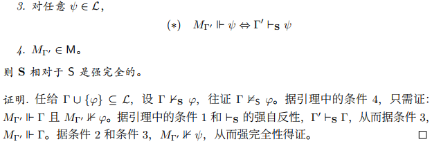
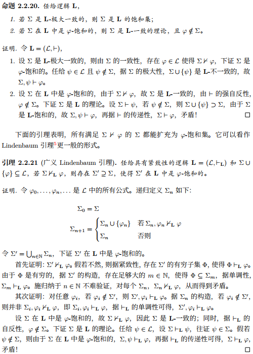

proposition 命题 命題  
symbol 符号 記号        
term 项 項  
n-ary function n元函数 n 項関数
constant 常元 定数（定項）
-   tautology (⊤) 永真式 恒真式  
    contradiction (⊥) 永假式 矛盾式 

variable 变元 変項  
bound variable 束缚变元 束縛変項  
free variable 自由变元 自由変項  
function symbol 函数符号 関数記号  
predicate symbol 谓词符号 述語記号  
atomic formula 原子命题 原子論理式  
logical connective 逻辑联结词 論理結合子
-   negation (¬) 否定 否定  
    conjunction (∧) 合取 連言  
    disjunction (∨) 析取 選言  
    implication (→) 蕴涵 含意  
    biconditional (↔) 双条件 等値  
    exclusive or (⊕) 异或 排他的論理和  
    nand (↑) 非与 否定積  
    nor (↓) 非或 否定和   

technical symbol:
- bracket (()) 括号 括弧  

universal quantifier 全称量词 全称限量子  
existential quantifier 存在量词 存在限量子  
induction hypothesis 归纳假设 帰納仮定
- 例：論理式 $F$ 性質 $P$ を満たすことを証明する：  
    Base Case 基本部分: 原子論理式は $P(PV)$ である  
    Hypothesis 仮定:　もし $P(\phi_1), P(\phi_2)$   
    帰納ステップ Inductive Step: $P(\phi_1\vee\phi_2)$...  
    結論: 論理式 $F$ 性質 $P$ を満たす

formula 公式 論理式  
  - Complexity 复杂度 複雑性:   
    $d(\alpha) := 0$  
    $d(\neg\varphi) := d(\varphi) + 1$   
    $d(\varphi\rightarrow\psi) := d(\varphi) + d(\psi)+ 1$   
    $d(\forall\varphi) := d(\varphi) + 1$ 

logic 逻辑 論理
  - a reason: $(\Gamma, \varphi)\in {\mathcal{P}(\mathcal{L})}\times\mathcal{L}$
  - 論理 :  $\mathbf{L}=(\mathcal{L}, \vdash)$, where $\vdash \subseteq \mathcal{P}(\mathcal{L})\times\mathcal{L}$ 
    - 用了证明论逻辑的常用符号，但这里代表一般性逻辑
  - 性質（論理と言える性質）:  
      - Reflexive 自反性 反射的 (はんしゃてき): $\varphi\vdash\varphi$  
      - Transitive 传递性 推移的 (すいいてき): If $\Gamma\vdash\Sigma$ and $\Sigma\vdash\varphi$, then $\Gamma\vdash\varphi$  
      - Monotonicity 单调性 単調性 (たんちょうせい): If $\Gamma\vdash\varphi$ and $\Gamma\subseteq\Sigma$, then $\Sigma\vdash\varphi$  
      - Compact 紧致的 コンパクト: If $\Gamma\vdash\varphi$, then exist finite set $\Phi\vdash\varphi$  
      - Formal/structural 形式的 形式的: If $\Sigma\vdash\varphi$, then $\Sigma^\sigma\vdash\varphi\sigma$  
  - 論理間の関係
    - Extension 扩张 拡張: $\mathbf{L'}$ is extended logic of $\mathbf{L}$ iff $\vdash \subseteq \vdash'$  
-----

比較：$\mathbf{L}=(\mathcal{L}, \vdash)$, $S = (M, \Vdash)$, $S = (Ax, R^p, R^d)$，後の2つはどうやって $\mathbf{L}$ を作るかと探ることである。すなわち、どうやって $\vdash$ を定義することで、意味論含意か、構文的含意か。

-----
  - 意味論理論: 
    - 意味論体系 $S = (M, \Vdash)$
      - モデル $M\neq \empty$、満足関係 $\Vdash\subseteq M\times\mathcal{L}$
      - satisfiability 可满足性 充足可能性： $\Sigma$ is satisfied in S iff if exist $w\in M, w\Vdash \Sigma$
      - semantic consequence 语义后承 意味論的含意: $\Sigma\vDash\varphi$ iff for any $w\in M$, if $w\Vdash \Sigma$ then $w\Vdash \varphi$
      - valid 有效的 妥当的: $\Sigma = \empty$, $\Vdash \varphi$
    - 規則  
      - 有效规则 $R$ : for any $(\Sigma,\varphi)\in R: \vDash\Sigma \Rightarrow \vDash\varphi$
      - 保真规则 $R$ : for any $(\Sigma,\varphi)\in R: \Sigma\vDash\varphi$ 
    - 表达力与不变性 可定义性 有穷模型性
  - 証明論理論:
    - 公理体系 $S = (Ax, R^p, R^d)$
      - 公理集合、証明規則、推理規則（前提集を用いる）
      - 

          
形式推演 形式演繹

          
        

      - 内定理 $\vdash \varphi$
      - syntactic consequence 句法后承 構文的含意 $\Sigma\vdash\varphi$ iff exist sequence $(\varphi_1, \varphi_2, ..., \varphi_n, m)$
        - 用 包含两种规则的 **形式推演** 定义 **句法后承**，可允规则和导出规则则是用句法后承定义的。可证 証明規則是可允规则，推理規則是导出规则。
      - 规則：
        - 可允规则 $R$ : for any $(\Sigma,\varphi)\in R: \vdash\Sigma \Rightarrow \vdash\varphi$  
        - 导出规则 $R$ : for any $(\Sigma,\varphi)\in R: \Sigma\vdash\varphi$  
      - 公理体系間の関係:
        - $S'$ is Extension of $S$ : $\vdash_S\subseteq\vdash_{S'}$
        - $S'$ is axiom Extension of $S$ : $\vdash_S\subseteq\vdash_{S'}$ and both share the same rules

  - 証明論理論と意味論理論の関係:
    - 健全性: $\vdash\varphi\Rightarrow\vDash\varphi$
      - 強健全性: $\vDash\subset\vdash$
      - 

          
Proof soundness

          
        

    - 完全性: $\vDash\varphi\Rightarrow\vdash\varphi$
      - 強完全性: $\vdash\subset\vDash$
      - 

          
Proof completeness IDEA

            
          
        

      - $\varphi$-Saturated $\varphi$-饱和的 $\varphi$-飽和した
        - $\Sigma$ is Saturated set in $\mathbf{L}$: exist $\varphi$ that $\Sigma$ is $\varphi$-Saturated
      - $\mathbf{L}$-consistent 一致的 無矛盾: exist $\varphi, \Sigma\nvdash\varphi$
        - Maximally consistent set 極大無矛盾集合: no $\Sigma', \Sigma\subset\Sigma'$
      - theory 理論: $\Sigma$ is theory of $\mathbf{L}$ iff $\Sigma\vdash\varphi$ then $\varphi\in\Sigma$
      - 

          
lindenbaumlemma

          
        

      - `ANOTER IDEA`: prove $\nvdash\varphi\Rightarrow\nvdash\varphi\Leftrightarrow t_0 = (\empty,\{\varphi\})$ is realizable 
      - Semantic Tableau: $t=(\Sigma, \Delta), \Sigma, \Delta\subseteq \mathcal{L}$ 
        - 

            
tableau

            
          

        - 

            
realizable

            
          

        - $t=(\Sigma, \Delta)$ is consistent in $\mathcal{L}$:  $\Sigma\vdash\varphi_1\vee\dots\vee\varphi_m$ and $\varphi_1\dots\varphi_m\notin\Delta$ that is $\Sigma\nvdash\bot$
      - 

          
tableauproof

          
        

      - prove $t_{n}$ is consistent.
      - prove $t_{n}$ is saturated and disjoint.
-------
以下具体的に

-------
proposition logic (Propositional Calculus) 命题逻辑 命題論理
- 意味論体系（モデル論理） $\mathbf{PC} = (V, \vDash)$ 
  - Assignment 赋值 割当 
    - $V: PV = \{p_1, p_2,...\} \rightarrow \{0, 1\}$
  - Satisfy 满足 満たす
    - $V\Vdash p$ iff $V(p) = 1$ 
    - $V\Vdash \neg\varphi$ iff $V(\varphi) = 1$
    - ...
  - Valuation function 赋值函数 割り当て関数
    - $\llbracket\cdot\rrbracket^{V}: \mathcal{L}\rightarrow\{0,1\}$
    - $\llbracket p\rrbracket^{V} = V(p)$
    - $\llbracket \varphi \land \psi \rrbracket^V := f_{\land}(\llbracket \varphi \rrbracket^V, \llbracket \psi \rrbracket^V)$
    - $\llbracket \varphi \land \psi \rrbracket^V := f_{\land}(\llbracket \varphi \rrbracket^V, \llbracket \psi \rrbracket^V)$
    - $\cdots$
    - $f$ can be given by Truth table 真值表 真理値表
  - Functional Completeness 函项完全性 関数完全性
    - 真值函项的连接词 c: $\quad \llbracket c_f (\varphi_1, \dots, \varphi_n) \rrbracket^V = f(\llbracket \varphi_1 \rrbracket^V, \dots, \llbracket \varphi_n \rrbracket^V)$
    - 反过来 $\varphi$ define n-ary function: $f_{\varphi}(x_1, \dots, x_n) := \llbracket \varphi \rrbracket^V$
    - 

        
functioncomplete

        
      

- 公理体系（証明論論理）
  - 公理    
    - PC1: $\quad p \to (q \to p)$   
    - PC2: $\quad (p \to (q \to r)) \to ((p \to q) \to (p \to r))$  
    - PC3: $\quad (\neg p \to q) \to ((\neg p \to \neg q) \to p)$  
  - rule:   
    - US: $\frac{\phi}{\psi^\sigma}$
    - MP: $\frac{\phi, \phi\rightarrow\psi}{\psi}$
- 自然演繹体系（証明論論理）
    - Gerhard Gentzen 根岑 1934-1935  
    - Elimination Rule 消除规则 除去規則 

      $\frac{
      A \quad \neg A
      }{
      \bot
      } \neg E$

      $\frac{
      A \land B
      }{
      A
      } \land E_1 \quad \frac{
      A \land B
      }{
      B
      } \land E_2$

      $\frac{
      A \lor B \quad
      \begin{array}{c}
        [A]^1 \\
        \vdots \\
        C
      \end{array} \quad
      \begin{array}{c}
        [B]^2 \\
        \vdots \\
        C
      \end{array}
      }{
      C
      }\lor E^{1,2}$

      $\frac{
      A \rightarrow B \quad A
      }{
      B
      } \rightarrow E$  

    - Introduction Rule 引入规则 導入規則  
  
      $\frac{
      \begin{array}{c}
          [\neg A]^1 \\
          \vdots \\
          \bot
      \end{array}
      }{
      A
      }
      \neg I^1$  
        
      $\frac{
      A \quad B
      }{
      A \land B
      }
      \land I, 
      \frac{
      A
      }{
      A \lor B
      }
      \lor I_1
      \quad 
      \frac{
      B
      }{
      A \lor B
      }
      \lor I_2$  

      $\frac{
      \begin{array}{c}
          [A]^1 \\
          \vdots \\
          B
      \end{array}
      }{
      A \rightarrow B
      }
      \rightarrow I^1$  

    - Reductio ad Absurdum 归谬法 反证法

        $\frac{
        \begin{array}{c}
            [\neg A]^1 \\ 
            \vdots \\
            \bot
        \end{array}
        }{
        A
        }
        RA^1$

- 

      
classical logic

      
  

- 健全性と完全性
  - 

      
truth lemma

      
    

first-order logic (Quantificational Calculus) 一阶逻辑 一階論理 
- language 言語
  - 基础词 Variable; constant; Function; Predicate; connective; quantifier 量化子 ${\forall}$; $\{=\}$; $\{(,)\}$
  - 项 $\mathcal{T}(Var,Con,Fun)$
  - formula 論理式 $\mathcal{L}(Var,Con,Fun,Pre)$
    - atomic formula: $P(t_1...t_n) | t=t'$
    - complex formula
    - Quantificational formula
    - Bool formula
  - 

      
Free variable 

      
    

  - 

      
substitute

      
    

  - free substitute: $F\varphi^{t}_{x}$
    - 

      
freesubstitute

      
      

- 意味論体系 $\mathbf{QC} = (M, \vDash)$ 
  - 模型 $\mathfrak{M}=(D, I)$
    - Domain 论域 論域
    - Interpretation 解释 解釈 $I = Con\cup Fun \cup Pre$
  - Assignment 指派 $g:Variable\rightarrow D$
    - 指派模型 $(\mathfrak{M}, g)$
  - 項の解釈
    - $x\in Var: x^{\mathfrak{M},g} = g(x)$
    - $c\in Con: c^{\mathfrak{M},g} = c^{\mathfrak{M}}$
    - $f(t_1\dots t_n)\in Fun: f^{\mathfrak{M}}(t_1^{\mathfrak{M},g}\dots t_n^{\mathfrak{M},g}) = g(x)$
  - 

        
满足关系

        
    

  - 语义后承 略
  - 

        
替换引理 substitutelemma

        
    

- 公理体系 
  - 公理
    - 命題論理公理PC1, PC2, PC3  
    - UD: $\forall x(\phi\rightarrow\psi)\rightarrow (\forall x\phi\rightarrow\forall x\psi)$   
    - UI: $\forall x\phi\rightarrow\phi[t/x]$  
    - VG: $\phi\rightarrow\forall x\phi, x\notin Fv(\phi)$  
  - rule:   
    - UG: $\frac{\phi}{\forall x \phi}$
    - MP: $\frac{\phi, \phi\rightarrow\psi}{\psi}$
- 自然演繹
  - Elimination Rule 消除规则 除去規則
    - 同命題规则,  
        $\frac{
        \forall x P(x)
        }{
        P(a)
        }
        \forall E, 
        \frac{
        \exists x P(x) \quad
        \begin{array}{c}
            [P(a)]^1 \\ 
            \vdots \\
            C
        \end{array}
        }{
        C
        }
        \exists E^1$  

  - Introduction Rule 引入规则 導入規則  
    - 同命題规则,  
        $\frac{
        \begin{array}{c}
            P(x) \\ 
            for any x
        \end{array}
        }{
        \forall x P(x)
        }
        \forall I, 
        \frac{
        P(a)
        }{
        \exists x P(x)
        }
        \exists I$  

- 健全性
  - 公理妥当性を証明する
- 完全性
  - 

        
canonical model 典范模型

        
    

    - 原子論理式の解釈は命題論理と同じ
  - canonical assignment: $\forall x\in Variable, g^\Gamma(x)=[x]_\Gamma$
  - 

        
全称量词的处理

        
    

--------
  
second-order logic 二阶逻辑 二階論理  
axiom 公理 公理  
theorem 定理 定理  
proof 证明 証明  
model 模型 モデル  
interpretation 解释 解釈  
validity 有效性 妥当性  
satisfiability 可满足性 充足性  
provability 可证性 証明可能性    
soundness 可靠性 健全性 
- 一階論理健全性の証明ツール：  
  - 公理は全部妥当である：  
    - 命題公理パターンは全部妥当である
    - 述語公理パターンは全部妥当である
  - MPとUGが $\vDash$ においても成立する

completeness 完备性 完全性
- canonical model 典范模型 カノニカルモデル

Löwenheim-Skolem 定理   
consistency 一致性 無矛盾性  
decidability 可判定性 決定可能性  
Gödel's incompleteness theorem 哥德尔不完全性定理 ゲーデルの不完全性定理  
recursive function 递归函数 再帰関数  
Turing machine 图灵机 チューリング機械  
lambda calculus λ演算 ラムダ計算  
type theory 类型论 型理論  
propositional logic 命题逻辑 命題論理  
predicate logic 谓词逻辑 述語論理  
modal logic 模态逻辑 様相論理  
intuitionistic logic 直觉主义逻辑 直観主義論理  
fuzzy logic 模糊逻辑 ファジー論理  
set theory 集合论 集合論  
formal system 形式系统 形式体系  
deductive system 演绎系统 演繹体系  
sequent calculus 序列演算 シーケント計算  
natural deduction 自然演绎 自然演繹  
structure 结构 構造
Symmetric 对称性 対称的 (たいしょうてき)  
Antisymmetric 反对称性 反対称的 (はんたいしょうてき)  
Euclidean 欧几里得性 ユークリッド的  
Equivalence relation 等价关系 同値関係 (どうちかんけい)