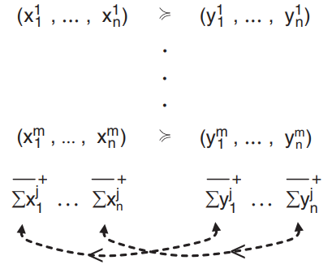

### 1.1 Basic definitions

state space `S` 
- One state s $\in$ S is true and the other states are not true

events: E, a subset of `S`
- E is true if it contains the true state
- complementary event S-E

outcome set `R` with real numbers designating amounts of money

prospects `x = (E_1:x_1, ..., E_n:x_n)` map states to the reals, describing the resulting outcome for every state if that state is the true state.

The domain of preference

Preferences and evaluations　≽
- A function　V represents ≽ if V evaluates prospects in agreement with preference.

(subjective) Probabilities

Expected value

In finance, `arbitrage` means that you can combine a number of portfolios in such a way that you always (in every state of the world) make a profit.

Dutch book - de Finetti (1931a)
- De Finetti’s bookmaking result has been fundamental in decision theory because it
provided the basis for subjective probability and Bayesian statistics. formulated his idea as a game between a bookmaker and a bettor 

**Definition 1.5.3. Arbitrage, or a _Dutch book_,** consists of preferences $x^j \succeq y^j$, $j = 1, \ldots, m$, such that the preferred prospects $x^j$, when combined, always (for each state $s$) yield less than the nonpreferred prospects $y^j$. That is, $\sum_{j=1}^m x^j(s) < \sum_{j=1}^m y^j(s)$ for all $s \in S$.

a Dutch book in your preference system suggests an irrationality on your part: You would prefer to replace yj by xj for all j, but all together these replacements simply make you worse off no matter which state is the true one. Dutch books can be interpreted as violations of a conservation-of-preference principle
