<!-- TOC -->

- [Certainty-Loss Framework (CLF)](#certainty-loss-framework-clf)
  - [summary： Certainty-Loss Framework (CLF) vs Bayesians](#summary-certainty-loss-framework-clf-vs-bayesians)
  - [2. Models and norms](#2-models-and-norms)
  - [3. The modeling framework and what models represent](#3-the-modeling-framework-and-what-models-represent)
  - [6. Generalized Conditionalization](#6-generalized-conditionalization)
  - [7. Suppositional consistency](#7-suppositional-consistency)
  - [8. The Proper Expansion Principle](#8-the-proper-expansion-principle)
  - [9. Applying (PEP)](#9-applying-pep)
      - [9.2.5 Modeling strategies](#925-modeling-strategies)
    - [9.3 Technicolor Beauty](#93-technicolor-beauty)
  - [10. Alternative updating schemes](#10-alternative-updating-schemes)

<!-- /TOC -->
<!-- /TOC -->

<!-- /TOC -->

# Certainty-Loss Framework (CLF)

## summary： Certainty-Loss Framework (CLF) vs Bayesians

**common systematic constraints**
Subjective Finite Additivity and the Ratio Formula along with the Conditionalization updating rule

**different systematic constraints**

Generalized Conditionalization (GC) vs. Conditionalization to solve memory loss. 

Proper Expansion Principle (PEP) to solve context-insensitive claims.

## 2. Models and norms

本章讨论了CLF作为一个模型的方法论。

- 什么是一个模型？
we can think of a formal model as a collection of symbols, strings of symbols, and sets or series of those strings and symbols organized in some fashion.
- 桥梁原则：连接形式模型与被建模对象的原则称为“桥梁原则”（最早由MacFarlane提出，这里被更一般意义上使用）

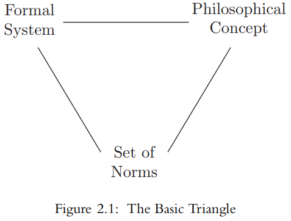

1. If $x \vdash y$ in a classical deductive system, then $y$ follows from $x$.
2. If $y$ follows from $x$, it is permissible to reason from $x$ to $y$.

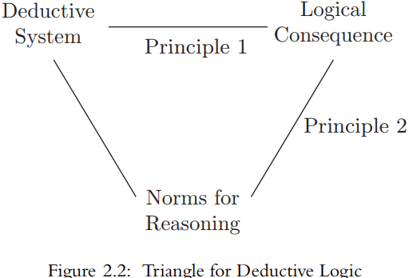

一些桥梁原则的例子：

Harman (1986) does an excellent job of drawing our attention to pernicious assumptions about the bridge principle between **logical consequence** and **norms for reasoning**. 
> “At this point, Mary’s beliefs are jointly inconsistent and therefore imply any proposition whatsoever. This does not authorize Mary to infer any proposition whatsoever” (1986)

Carnap:
>  if an evidence sentence e confirms a hypothesis h to degree r, then an agent whose total evidence is represented by e is justified in believing h to degree r (1950, p. 211)
> 
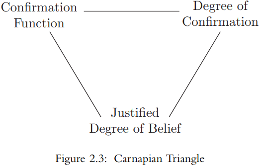

The triangle used most often by Bayesians relates a function from some set to the reals, **a philosophical notion of “probability,”** and normative requirements on an agent’s degrees of belief.

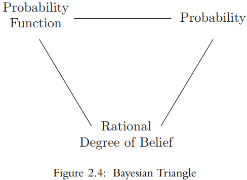

CLF 直接是规范性要求的模型，而不关心概率的概念讨论
- **CLF** (a formal system) yields verdicts about the requirements of rationality (a set of norms) directly—there is no middleman -  using a formal system to get results about normative requirements
- 好处：不用考虑主体脑袋中的内容，例如 $P_1(x) = \frac{1}{2}$， 可以得到 $P_1(x\rightarrow \neg x) \geqslant \frac{1}{2}$，需要解释主体能想到 $x\rightarrow \neg x$ 很困难，但CLF跳过这一步，只是说如果不这么想违背理性要求。

## 3. The modeling framework and what models represent
The goal of a CLF model is to determine what requirements an agent's changing set of certainties places on her degrees of belief in claims of which she is less-than-certain.

Changes in confidence over time are exactly the sort of thing CLF models were designed to represent

- a time set
- a modeling language
- a set of extrasystematic constraints

## 6. Generalized Conditionalization
In place of the traditional Conditionalization updating rule, CLF has two diachronic systematic constraints: 
- **Generalized Conditionalization** (GC)
- **Proper Expansion Principle** (PEP)
  
These constraints help CLF model two types of certainty-loss stories: 
- stories involving memory loss -- (GC)
- stories involving context-sensitive claims -- (GC) and (PEP)

traditional Bayesian updating rule - Conditionalization: For any $t_j,t_k \in T$ with $j\leq k$ and any $x \in L$, 

$$P_k(x) = P_j(x | \langle C_k − C_j\rangle)$$

- $L$ is a set of sentences representing claims to which the agent might assign degrees of belief
- $P_j$ and $P_k$ are credence functions representing the agent's degrees of belief at $t_j$ and $t_k$ respectively
- $C_k - C_j$ is a set consisting of every sentence in $C_k$ but not $C_j$
- The angle-bracket notation gives us a proxy sentence for $C_k - C_j$ that is logically equivalent to the conjunction of all the sentences in that set; **if the set is empty, the angle-brackets yield a tautology**

counter example:
- Spaghetti - Talbott (1991)
- Shangri La - Arntzenius (2003)

The only interesting **difference** between Spaghetti and the Path by the Sea case is that in the latter the memory loss results from the operations of outside agents instead of from natural processes.

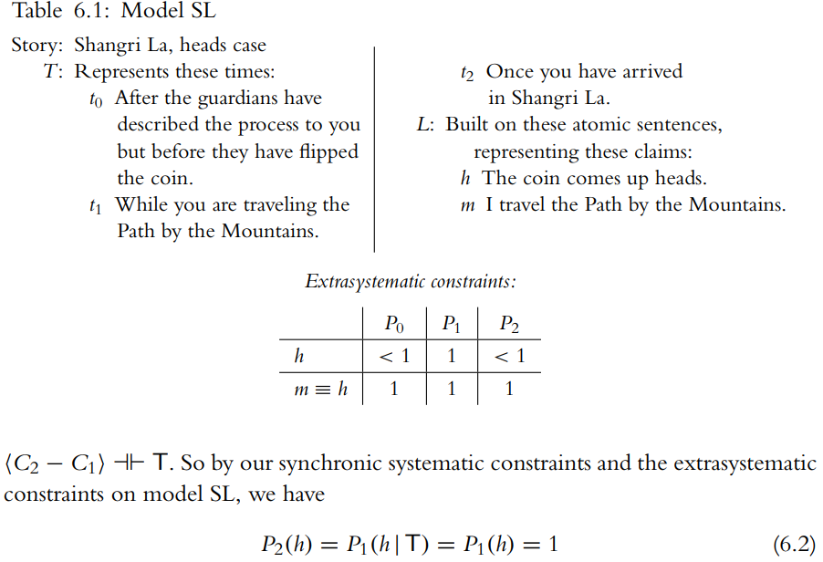

备注，打不出来这个符号，如果后面用上，用 $\langle C_2 − C_1\rangle \Leftrightarrow T$ 代替。

Conditionalization-based model will indicate that her doxastic evolution violates the requirements of ideal rationality.

**Limited Conditionalization (LC)**: For any $t_j,t_k \in T$ with $j\leq k$ and any $x \in L$, if $C_j \subseteq C_k$
$$P_k(x) = P_j(x | \langle C_k − C_j\rangle)$$

it's a **defensive move**, preventing our models from making certain mistakes—from yielding incorrect verdicts relating credences at two times. But, since $C_0 \subseteq C_2$, (LC)-based version of SL will yield:
$$P_2(h) = P0(h | T) = P_0(h)$$

**reset** to precisely what it was before you began your trip. 

> 可能有人提出反对意见，即（LC）对于 Shangri La 的“解决方案”基于对模型 SL（Shangri La）的外系统约束建立的假设，即你在 t2 时对正面的确信度应该不足，但这正是一个良好的更新方案应该告诉我们的内容。我已经明确表示，我并不打算让 CLF 告诉我们关于一个代理人信念状态在两个时间点之间如何演变的一切 —— CLF 接受有关代理人确信度及其要求的规定作为输入，然后产生关于代理人不太确定的信念度具体值的结论作为输出。正如我在第 3.3 节中讨论的那样，我们不需要像贝叶斯建模框架那样复杂的机制来确定代理人在特定时间点上应该确信的事情。例如，Arntzenius 可以提出论点，一旦你到达 Shangri La，你就不应该信任你的记忆，因此在他应用任何贝叶斯机制之前，你就不应该确信硬币是正面朝上的。CLF 的输入是你在 t2 时对正面不应该完全确信的事实，并输出的是这种非极端确信度应该恰好为 1/2。

**reverse-temporal conditionalization**:

Since $C_0 \subseteq C_1$,
$$P_1(y) = P_0(y | \langle C_1 - C_0\rangle)$$

by Ratio Formula (满足 $P_0(\neg C_1 - C_0) < 1$):
$$P_1(y) = \frac{P_0(y \wedge \langle C_1 - C_0\rangle)}{P_0(\langle C_1 - C_0\rangle)}$$

by $P_2(y) = P_0(y)$:
$$P_1(y) = \frac{P_2(y \wedge \langle C_1 - C_0\rangle)}{P_2(\langle C_1 - C_0\rangle)}$$

by $\langle C_1 - C_0\rangle \Leftrightarrow \langle C_1 - C_2\rangle$:
$$P_1(y) = \frac{P_2(y \wedge \langle C_1 - C_2\rangle)}{P_2(\langle C_1 - C_2\rangle)}$$

by Ratio Formula:
$$P_1(y) = P_2(y | \langle C_1 - C_2\rangle)$$

$$P_2(y | \langle C_1 - C_2\rangle) = P_0(y | \langle C_1 - C_0\rangle)$$

your unconditional degrees of belief at the earlier time equal your degrees of belief at the later time conditional on the certainties lost in-between. 
> “inverse temporal credal conditionalization” at (Levi, 1980, Section 4.3)

But imagine we have a story with only two times, between which a pure information-loss event occurs. There will be no $t_j$ and $t_k ( j < k)$ available such that $C_j \subseteq C_k$, so the (LC)-based framework will be unable to yield any diachronic verdicts for this story. 

**Generalized Conditionalization (GC)**: For any $t_j,t_k \in T$ with $j\leq k$ and any $x \in L$, if $P_j(\neg \langle C_k − C_j\rangle) < 1$ and $P_k(\neg \langle C_j − C_k\rangle) < 1$, then
$$P_j(x | \langle C_k − C_j\rangle) = P_j(x | \langle C_j − C_k\rangle)$$

>前提条件是根据句子的无条件置信度小于1来制定的，以便与CLF版本的Ratio Formula中的前提条件相匹配，并且(GC)可以在推导中使用。为了在推导的一行中引入(GC)的一个实例，我们首先确定哪些句子属于$C_k - C_j$和$C_j - C_k$，然后确定$P_j(\neg \langle C_k − C_j\rangle)$和 $P_k(\neg \langle C_j − C_k\rangle)$是否都小于1。

(GC) as a generalization of traditional conditionalization constraints because it relates credences separated by **pure learning events** (yielding forward-temporal conditionalizations), by **pure information-loss events** (yielding reverse-temporal conditionalizations), and by **mixed doxastic events** (yielding relations between conditional credences at the two times).

## 7. Suppositional consistency

…………

## 8. The Proper Expansion Principle

**epistemically context-insensitive**： relative to a particular story and time set if ideal rationality requires the agent in the story to be certain at every time in the time set that the claim has the **same truth-value** it had or will have at every other time in the time set.

**epistemically context-sensitive**: if it is not epistemically context-insensitive

>  following MacFarlane (2005) in using ``context-sensitive" to mark changes in truth-value over time as opposed to changes in content.

Given two models $M^-$ and $M$, we will call $M$ an expansion of $M^-$ just in case the
following conditions are met:
- $M^-$ and $M$ have the same time set. ($T^- =T$)
- The modeling language of $M^−$ is a subset of the modeling language of $M$. ($L^- \subseteq L$)
- Given any arithmetic statement in $M^-$, that statement is an extrasystematic
constraint on $M^-$ just in case its analogue in $M$ is an extrasystematic constraint on $M$.

We call $M^-$ a **reduction** of $M$ just in case $M$ is an expansion of $M^-$.

Model M is a **perfect expansion** of model $M^-$ just in case $M$ is an expansion of $M^-$ and 
$$(\forall y \in L)(\exists x \in L^- )(\forall t_i \in T)(P_i(x \equiv y) = 1)$$

**Theorem E.3**: If M is a perfect expansion of model $M^-$, the analogue of any verdict of $M^-$ is a verdict of $M$.

例子：

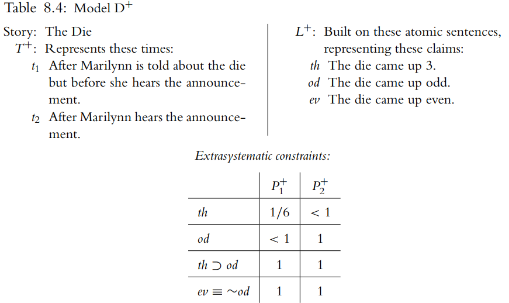

Since the only atomic sentence (ev) in $L^+$ that is not in $L$ has the same truth-value equivalent in $L$ at every time in the time set, model $D^+$ is a perfect expansion of model D. We already know that $P_2(th)>1/6$ is a verdict of $D$; Theorem E.3 guarantees us that $P^+_2(th)>1/6$ is a verdict of $D^+$ as well. 

So taking a model (like D) that already represents "odd" claims and adding to it a set of sentences representing "even" claims (as in D+) does not alter our verdicts concerning whether the die came up 3.

refer to two expressions as **synonymous** for an agent at a time if the agent is certain at that time that their denotation is the same.

---

attempting to do: We want to be able to start with a model whose language represents both context-sensitive and context-insensitive claims, move down to its context-insensitive reduction, derive some verdicts in that model, and then make analogues of those verdicts into constraints on our original model. So we need a principle defining conditions under which the verdicts of a context-insensitive reduction can be brought up to its expansion.

Model $M$ is a **proper expansion** of model $M^-$ just in case $M$ is an expansion of $M^-$ and
$$(\forall y \in L)(\forall t_i \in T)(\exists x \in L^- )(P_i(x \equiv y) = 1)$$

If $M$ is a proper expansion of $M^-$ we will call model $M^-$ a **proper reduction** of model $M$.

**Proper Expansion Principle (PEP)**: If model $M$ is a proper expansion of its context-insensitive reduction $M^-$, the analogue of any verdict of $M^-$ is a verdict of $M$.

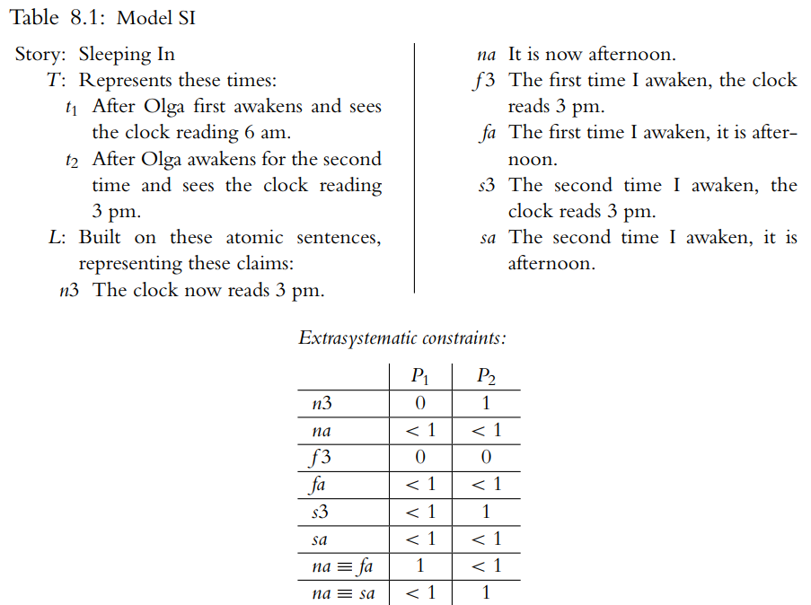

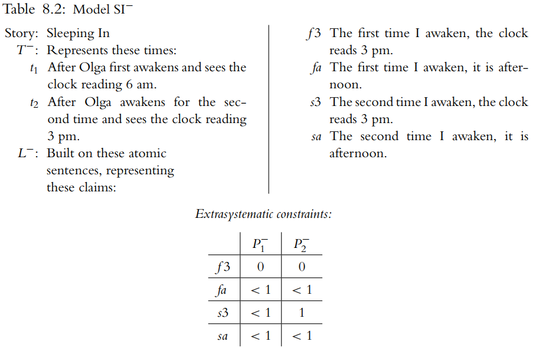

## 9. Applying (PEP)

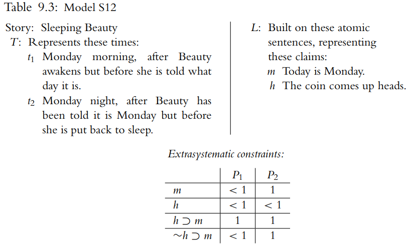

by (GC):
$$P_2(h) = P_2(h | T) = P_1(h | m)$$

by Ratio Formula:
$$P_2(h) = \frac{P_1(h \wedge m) }{P_1(m)}$$

Finite Additivity:
$$P_1(h) = P_1(h \wedge m) + P_1(h \wedge \neg m)$$

By the extrasystematic constraints $P_1(h \rightarrow m) = 1$:

$$P_1(h) = P_1(h \wedge m)$$

$$P_2(h) = \frac{P_1(h) }{P_1(m)}$$

$$P_2(h) = \frac{P_1(h) }{P_1(m\wedge h)+P_1(m\wedge \neg h)}$$

$$P_2(h) = \frac{P_1(h) }{P_1(h)+P_1(m|\neg h)\cdot (1-P_1(h))}$$

---
$$P_2(h) > \frac{P_1(h) }{P_1(h)+1 \cdot (1-P_1(h))} = P_1(h)$$

---
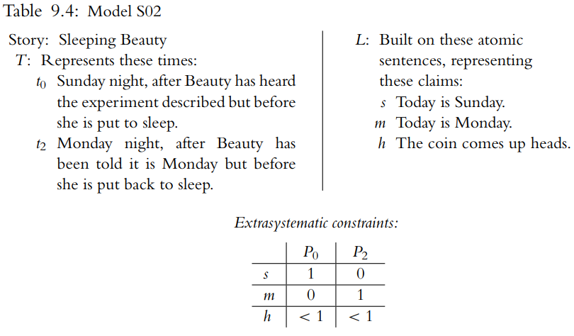

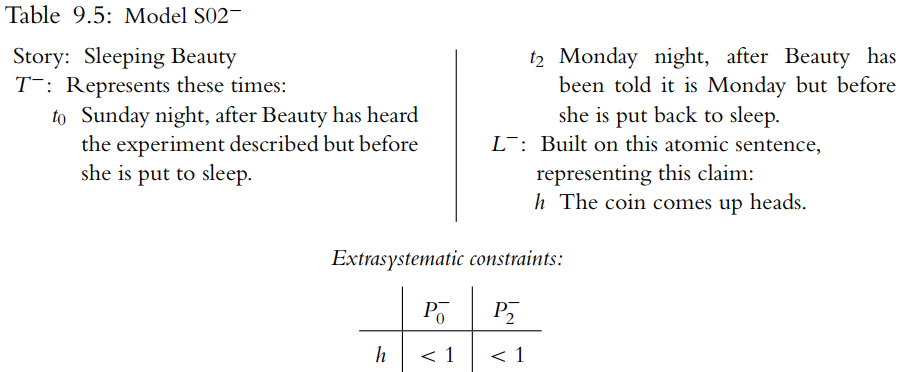

Beauty does at each time in the model's time set have a context-insensitive expression that she is certain uniquely picks out the denotation of “today : “Sunday” at t0 and “Monday” at t1. So the context-insensitive reduction of S02 will also be a proper reduction.

apply (GC) to model $S02^−$:
$$P_2^-(h|T) = P_0^-(h|T)$$
$$P_2^-(h) = P_0^-(h)$$
$S02$ is a proper expansion of $S02^−$: $P_0(s \equiv T) = 1, P_2(s \equiv F) = 1, P_0(m \equiv F) = 1, P_2(m \equiv T) = 1$

by (PEP):
$$P_2(h) = P_0(h)$$
SUM: 
$$P_0(h) > P_1(h)$$

using CLF’s systematic constraints; neither the Principal Principle nor any indifference principle was required. This is sufficient to refute the “halfer” position on the Sleeping Beauty Problem.

Objection:
> Nick Bostrom (2007): Between t1 and t2 Beauty becomes certain not only of the claim “Today is Monday, ” but also of the claim “I have been told today that today is Monday. ” Bostrom argues that Beauty’s Monday night degree of belief in heads is required to equal her Monday morning degree of belief in heads conditional on both these claims, and there is no reason to think that this conditional degree of belief should be greater than Beauty’s unconditional Monday morning degree of belief in heads. So we cannot rely on conclusion that P2(h) > P1(h).

Answer:
> 类似于 Table-8-4，By (PEP)可以证明复合命题不影响结论。

Objection:
> ignores the role of memory loss

Answer:
> 考虑等价复制人实验，不存在记忆丢失，也用相同方法建模。

#### 9.2.5 Modeling strategies

the **lack of a context-insensitive truth-value equivalent for the central context-sensitive claim** in the Sleeping Beauty Problem is what kept the philosophical community from solving the problem immediately.
- 重点是缺少非文本敏感的等价对应，而非记忆缺失这一设定本身。
- Beauty has a well-understood degree of belief distribution on Sunday night - why couldn’t we just conditionalize that on what she learns between Sunday and Monday to determine her Monday morning degree of belief in heads?
  - Beauty both gains and loses certainty in context-sensitive claims between Sunday and Monday
- CLF: 
  - (x) directly modeling the transition from Sunday night to Monday morning
    - 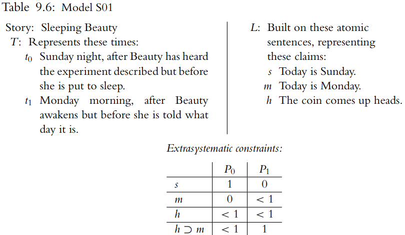
    - (GC) will not give us any diachronic verdicts for this model, and it will be incapable of deriving Beauty’s Monday morning degrees of belief from her Sunday-night distribution.
    - move to a proper reduction of model S01?
      - Beauty lacks a context-insensitive expression at t1 that she is certain uniquely picks out the denotation of “today”. 
  - (v) first compared Beauty’s Monday morning degrees of belief to those required on Monday night, then compared the latter to her Sunday doxastic attitudes.
    -  S12: “today” does not change its denotation between those two times, not context-sensitive. use (GC): rationality requires Beauty to be more confident of heads on Monday night than she is on Monday morning.
    -  S02“Today”is context-sensitive relative to those two times, but at each of those times Beauty has a context-insensitive uniquely denoting expression for“today. ” using (PEP)

添加了第三个时间t2和不添加情况下两种实验对t1的信念有影响吗？
> Our assumption has been that just by letting Beauty know that she is shortly to be told what day it is, the experimenters have not altered her rationally-required Monday morning degree of belief in heads. Because CLF cannot yield substantive models of Beauty’s Monday morning degrees of belief absent an addition to the story, I know of no way to formally prove that the addition makes no difference. But the assumption seems highly plausible in this case, and I have never seen it challenged

Add a different feature to the original Sleeping Beauty Problem: The trick will be to keep our added feature independent of the degrees of belief we’re after, so that the addition doesn’t alter the requirements of ideal rationality on Beauty’s unconditional Monday morning degree of belief in heads.

### 9.3 Technicolor Beauty 

> Everything is exactly as in the original Sleeping Beauty Problem, with one addition: Beauty has a friend on the experimental team, and before she falls asleep Sunday night he agrees to do her a favor. While the other experimenters flip their fateful coin, Beauty’s friend will go into another room and roll a fair die. (The outcome of the die roll is independent of the outcome of the coin flip. ) If the die roll comes out odd, Beauty’s friend will place a piece of red paper where Beauty is sure to see it when she awakens Monday morning, then replace it Tuesday morning with a blue paper she is sure to see if she awakens on Tuesday. If the die roll comes out even, the process will be the same, but Beauty will see the blue paper on Monday and the red paper if she awakens on Tuesday

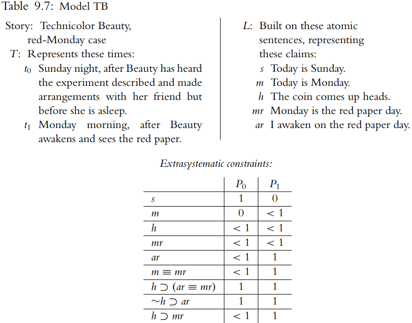

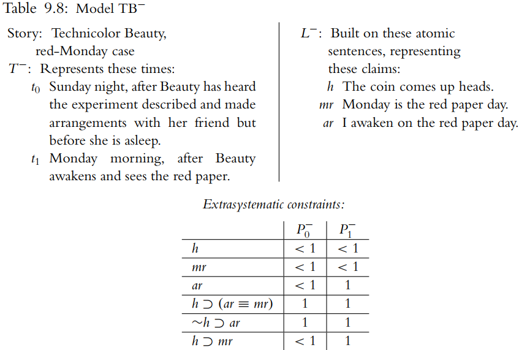

by (GC):
$$P_1^- (h | T) = P_0^-(h | ar \wedge (h \rightarrow mr) )$$

$TB^-$ is $TB$'s context-insensitive reduction. $TB$ is a proper expansion of $TB^-$: $P_0(s \equiv T) = 1, P_1(s \equiv F) = 1, P_0(m \equiv F) = 1, P_2(m \equiv mr) = 1$

by (PEP):
$$P_1 (h | T) = P_0(h | ar \wedge (h \rightarrow mr) ) = P_0(h | ar)$$
by constraints:
$$P_0(\neg h) = P_0(\neg h \wedge ar)$$
by Ratio Formula:
$$P_1(h) = \frac{P_0(h \wedge ar)}{P_0(ar)} = \frac{P_0(h \wedge ar)}{P_0(h \wedge ar) + P_0(\neg h \wedge ar)}$$
$$P_1 (h) = \frac{P_0(mr | h)\cdot P_0(h)}{P_0(mr | h)\cdot P_0(h) + 1 - P_0(h)}$$

> expresses Beauty’s Monday morning degree of belief in heads in terms of two values: her Sunday night degree of belief that the coin will come up heads, and her Sunday night degree of belief that the die roll will come out odd conditional on the coin’s coming up heads.

Principal Principle yields $P_0(h)=1/2$ and $P_0(mr|h)=1/2$. If we add these as extrasystematic constraints on model $TB$:
$$P_1(h)=\frac{1}{3}$$

objection:
> Beauty’s required t1 degree of belief in heads in Technicolor Beauty does not match her required t1 degree of belief in heads in the Sleeping Beauty Problem.

**answer: four-step argument**

add a time on Monday morning in the Technicolor Beauty red-Monday case just after Beauty awakens but just before she sees the red paper: $t=0.5$

step1. $P_1(h) = \frac{1}{3}$ in Technicolor case

step2. $P_{0.5}(h)$ in Technicolor case $= P_1(h)$ in original case

step3. $P_{0.5}(h|\textup{Today is the red paper day}) = \frac{1}{3}$

step3. $P_{0.5}(h) = \frac{1}{3}$

## 10. Alternative updating schemes

Halpern (2005) Meacham (2008) HTM

The intuitive idea is that if an agent has an experience in which she gains certainty **only** in claims about her **spatio-temporal location**, that experience shouldn't affect her evaluation of more general **conditions in the world** in any way (uncentered worlds). 
> David Lewis: Only new relevant evidence, centred or uncentred, produces a change in credence; and the evidence ['Today is Monday or Tuesday'] is not relevant to Heads versus Tails.

**Relevance-Limiting Thesis**: 
> If an agent receives(or loses) only centered evidence between two times, her doxastic evolution violates the requirements of ideal rationality if the degree of belief it assigns to any uncentered world changes between those times.

Lewis cannot maintain the Relevance-Limiting Thesis consistently：between those two times she gains only centered evidence—nothing that she learns eliminates any uncentered worlds for her. it’s no surprise that most halfers
about Sleeping Beauty have now **moved to a double-halfing position**.

Double-halfing conflicts with the results of applying a **powerful intuition** to the Sleeping Beauty Problem. 
>  On Monday morning Beauty considers two possibilities: it’s either Monday or it’s not. If it’s not Monday, there’s no way the coin came up heads(because whatever day it is, she’s awake on that day, and if the coin came up heads that can’t happen on Tuesday). So when Beauty learns that it’s Monday, eliminating the possibility that it’s not Monday, that should increase her degree of belief in heads. This is the result CLF yields, and it is in direct conflict with the Relevance-Limiting Thesis.

**difference** between the HTM and  CLF:
- HTM: divides claims into two kinds (centered and uncentered)
- CLF: divides claims into epistemically context-sensitive versus epistemically context-insensitive

> Between t1 and t2 in the Sleeping Beauty Problem “Today is Monday” may be a centered claim, but it is not epistemically context-sensitive. Beauty is certain that“today”doesn’t change its denotation between t1and t2, and she doesn’t lose certainty in any“today”claims. So CLF allows Beauty to update by conditionalizing on“Today is Monday”just as she would on any normal, well-behaved uncentered claim.

in Technicolor Beauty HTM assigns $P_{0.5}(h) = \frac{1}{2}$ and $P_1(h) = \frac{1}{3}$