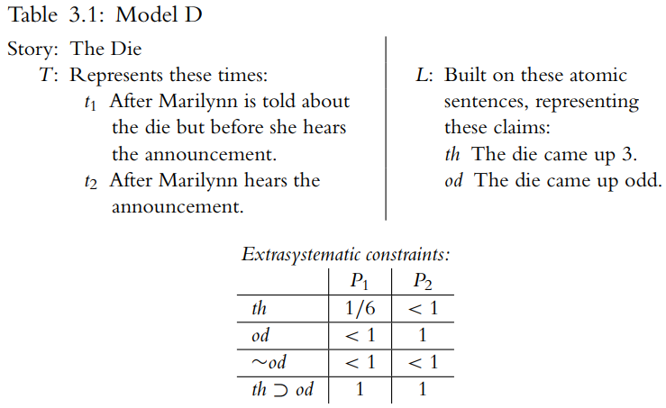

<!-- TOC -->

- [Certainty-Loss Framework (CLF)](#certainty-loss-framework-clf)
  - [summary： Certainty-Loss Framework (CLF) vs Bayesians](#summary-certainty-loss-framework-clf-vs-bayesians)
  - [2. Models and norms](#2-models-and-norms)
  - [3. The modeling framework and what models represent](#3-the-modeling-framework-and-what-models-represent)
    - [3.1 Stories and claims](#31-stories-and-claims)
  - [6. Generalized Conditionalization](#6-generalized-conditionalization)
  - [7. Suppositional consistency](#7-suppositional-consistency)
  - [8. The Proper Expansion Principle](#8-the-proper-expansion-principle)
  - [9. Applying (PEP)](#9-applying-pep)
      - [9.2.5 Modeling strategies](#925-modeling-strategies)
    - [9.3 Technicolor Beauty](#93-technicolor-beauty)
  - [10. Alternative updating schemes](#10-alternative-updating-schemes)
  - [11. Indifference principles and quantum mechanics](#11-indifference-principles-and-quantum-mechanics)
    - [11.1 The Indifference Principle](#111-the-indifference-principle)
      - [11.1.2 CLF and Duplication](#1112-clf-and-duplication)
      - [11.1.4 Weatherson’s objections](#1114-weathersons-objections)
    - [11.2 Fission and cloning](#112-fission-and-cloning)
    - [11.3 Quantum mechanics](#113-quantum-mechanics)
  - [**11. 不可区分原则与量子力学**](#11-不可区分原则与量子力学)
    - [**11.1 不可区分原则**](#111-不可区分原则)
      - [**11.1.1 Elga 的论证**](#1111-elga-的论证)
      - [**11.1.2 CLF 模型与复制问题**](#1112-clf-模型与复制问题)
      - [**11.1.3 颜色纸的适用性**](#1113-颜色纸的适用性)
      - [**11.1.4 Weatherson 的反对意见**](#1114-weatherson-的反对意见)
    - [**11.2 分裂与克隆**](#112-分裂与克隆)
      - [**11.2.1 分裂与信念一致性**](#1121-分裂与信念一致性)
      - [**11.2.2 三种形而上学解释**](#1122-三种形而上学解释)
      - [**11.2.3 克隆**](#1123-克隆)
    - [**11.3 量子力学中的信念更新**](#113-量子力学中的信念更新)
      - [**11.3.1 Everett 诠释与 CLF**](#1131-everett-诠释与-clf)
      - [**11.3.2 结论**](#1132-结论)
  - [12 A few loose ends](#12-a-few-loose-ends)
    - [12.1 Dutch Books](#121-dutch-books)
      - [12.1.1 Dutch Books and context-sensitivity](#1211-dutch-books-and-context-sensitivity)
      - [12.1.2 Dutch Books and memory loss](#1212-dutch-books-and-memory-loss)
    - [12.2 Jeffrey Conditionalization](#122-jeffrey-conditionalization)

<!-- /TOC -->

# Certainty-Loss Framework (CLF)

## summary： Certainty-Loss Framework (CLF) vs Bayesians

**common systematic constraints**
[Subjective Finite Additivity](主观有限可加性) and the [Ratio Formula](比率公式) along with the [Conditionalization updating rule](条件化更新规则)

**different systematic constraints**

Generalized Conditionalization (GC) vs. Conditionalization to solve memory loss. 

Proper Expansion Principle (PEP) to solve context-insensitive claims.

## 2. Models and norms

本章讨论了CLF作为一个模型的方法论。

- 什么是一个模型？
we can think of a formal model as a collection of symbols, strings of symbols, and sets or series of those strings and symbols organized in some fashion.
- 桥梁原则：连接形式模型与被建模对象的原则称为“桥梁原则”（最早由MacFarlane提出，这里被更一般意义上使用）
  > In What Sense (If Any) Is Logic Normative for Thought? 

1. If $x \vdash y$ in a classical deductive system, then $y$ follows from $x$.
2. If $y$ follows from $x$, it is permissible to reason from $x$ to $y$.

一些桥梁原则的例子：

Harman (1986) does an excellent job of drawing our attention to pernicious assumptions about the bridge principle between **logical consequence** and **norms for reasoning**. 
> “At this point, Mary's beliefs are jointly inconsistent and therefore imply any proposition whatsoever. This does not authorize Mary to infer any proposition whatsoever” (1986)

Carnap:
>  if an evidence sentence e confirms a hypothesis h to degree r, then an agent whose total evidence is represented by e is justified in believing h to degree r (1950, p. 211)
> 

The triangle used most often by Bayesians relates a function from some set to the reals, **a philosophical notion of “probability,”** and normative requirements on an agent's degrees of belief.

CLF 直接是规范性要求的模型，而不关心概率的概念讨论
- **CLF** (a formal system) yields verdicts about the requirements of rationality (a set of norms) directly—there is no middleman -  using a formal system to get results about normative requirements
- 好处：不用考虑主体脑袋中的内容，例如 $P_1(x) = \frac{1}{2}$， 可以得到 $P_1(x\rightarrow \neg x) \geqslant \frac{1}{2}$，需要解释主体能想到 $x\rightarrow \neg x$ 很困难，但CLF跳过这一步，只是说如果不这么想违背理性要求。

## 3. The modeling framework and what models represent
The goal of a CLF model is to determine what requirements an agent's changing set of certainties places on her degrees of belief in claims of which she is less-than-certain.

Changes in confidence over time are exactly the sort of thing [CLF models]() were designed to represent

- a time set
- a modeling language
- a set of [extrasystematic constraints](系统外约束)
  - 简单来说就是对确定性Certainty的解释，如果确定或能被确定的推出，则 $P_1(x) = 1$
  - 如果非确定，则 $P_1(x) < 1$

### 3.1 Stories and claims

## 6. Generalized Conditionalization
In place of the traditional Conditionalization updating rule, CLF has two diachronic systematic constraints: 
- **Generalized Conditionalization** (GC)
- **Proper Expansion Principle** (PEP)
  
These constraints help CLF model two types of certainty-loss stories: 
- stories involving memory loss -- (GC)
- stories involving context-sensitive claims -- (GC) and (PEP)

traditional Bayesian updating rule - Conditionalization: For any $t_j,t_k \in T$ with $j\leq k$ and any $x \in L$, 

$$P_k(x) = P_j(x | \langle C_k − C_j\rangle)$$

- $L$ is a set of sentences representing claims to which the agent might assign degrees of belief
- $P_j$ and $P_k$ are credence functions representing the agent's degrees of belief at $t_j$ and $t_k$ respectively
- $C_k - C_j$ is a set consisting of every sentence in $C_k$ but not $C_j$
- The angle-bracket notation gives us a proxy sentence for $C_k - C_j$ that is logically equivalent to the conjunction of all the sentences in that set; **if the set is empty, the angle-brackets yield a tautology T**

counter example:
- Spaghetti - Talbott (1991)
- Shangri La - Arntzenius (2003)

The only interesting **difference** between Spaghetti and the Path by the Sea case is that in the latter the memory loss results from the operations of outside agents instead of from natural processes.

备注，打不出来这个符号，如果后面用上，用 $\langle C_2 − C_1\rangle \Leftrightarrow T$ 代替。

Conditionalization-based model will indicate that her doxastic evolution violates the requirements of ideal rationality.

**Limited Conditionalization (LC)**: For any $t_j,t_k \in T$ with $j\leq k$ and any $x \in L$, if $C_j \subseteq C_k$
$$P_k(x) = P_j(x | \langle C_k − C_j\rangle)$$

it's a **defensive move**, preventing our models from making certain mistakes—from yielding incorrect verdicts relating credences at two times. But, since $C_0 \subseteq C_2$, (LC)-based version of SL will yield:
$$P_2(h) = P_0(h | T) = P_0(h)$$

**reset** to precisely what it was before you began your trip. 

> 可能有人提出反对意见，即（LC）对于 Shangri La 的“解决方案”基于对模型 SL（Shangri La）的外系统约束建立的假设，即你在 t2 时对正面的确信度应该不足，但这正是一个良好的更新方案应该告诉我们的内容。我已经明确表示，我并不打算让 CLF 告诉我们关于一个代理人信念状态在两个时间点之间如何演变的一切 —— CLF 接受有关代理人确信度及其要求的规定作为输入，然后产生关于代理人不太确定的信念度具体值的结论作为输出。正如我在第 3.3 节中讨论的那样，我们不需要像贝叶斯建模框架那样复杂的机制来确定代理人在特定时间点上应该确信的事情。例如，Arntzenius 可以提出论点，一旦你到达 Shangri La，你就不应该信任你的记忆，因此在他应用任何贝叶斯机制之前，你就不应该确信硬币是正面朝上的。CLF 的输入是你在 t2 时对正面不应该完全确信的事实，并输出的是这种非极端确信度应该恰好为 1/2。

**reverse-temporal conditionalization**:

Since $C_0 \subseteq C_1$,
$$P_1(y) = P_0(y | \langle C_1 - C_0\rangle)$$

by Ratio Formula ( 满足 $P_0(\neg (C_1 - C_0))$ ，？也就是要求 $P_0(C_1 - C_0)>0$ 对吧 ):
$$P_1(y) = \frac{P_0(y \wedge \langle C_1 - C_0\rangle)}{P_0(\langle C_1 - C_0\rangle)}$$

by $P_2(y) = P_0(y)$:
$$P_1(y) = \frac{P_2(y \wedge \langle C_1 - C_0\rangle)}{P_2(\langle C_1 - C_0\rangle)}$$

by $\langle C_1 - C_0\rangle \Leftrightarrow \langle C_1 - C_2\rangle$:
$$P_1(y) = \frac{P_2(y \wedge \langle C_1 - C_2\rangle)}{P_2(\langle C_1 - C_2\rangle)}$$

by Ratio Formula:
$$P_1(y) = P_2(y | \langle C_1 - C_2\rangle)$$

$$P_2(y | \langle C_1 - C_2\rangle) = P_0(y | \langle C_1 - C_0\rangle)$$

your unconditional degrees of belief at the earlier time equal your degrees of belief at the later time conditional on the certainties lost in-between. 
> “inverse temporal credal conditionalization” at (Levi, 1980, Section 4.3)

But imagine we have a story with only two times, between which a pure information-loss event occurs. There will be no $t_j$ and $t_k ( j < k)$ available such that $C_j \subseteq C_k$, so the (LC)-based framework will be unable to yield any diachronic verdicts for this story. 

**Generalized Conditionalization (GC)**: For any $t_j,t_k \in T$ with $j\leq k$ and any $x \in L$, if $P_j(\neg \langle C_k − C_j\rangle) < 1$ and $P_k(\neg \langle C_j − C_k\rangle) < 1$, then
$$P_j(x | \langle C_k − C_j\rangle) = P_k(x | \langle C_j − C_k\rangle)$$

>前提条件是根据句子的无条件置信度小于1来制定的，以便与CLF版本的Ratio Formula中的前提条件相匹配，并且(GC)可以在推导中使用。为了在推导的一行中引入(GC)的一个实例，我们首先确定哪些句子属于$C_k - C_j$和$C_j - C_k$，然后确定$P_j(\neg \langle C_k − C_j\rangle)$和 $P_k(\neg \langle C_j − C_k\rangle)$是否都小于1。

(GC) as a generalization of traditional conditionalization constraints because it relates credences separated by **pure learning events** (yielding forward-temporal conditionalizations), by **pure information-loss events** (yielding reverse-temporal conditionalizations), and by **mixed doxastic events** (yielding relations between conditional credences at the two times).

## 7. Suppositional consistency

…………

## 8. The Proper Expansion Principle

**epistemically context-insensitive**： relative to a particular story and time set if ideal rationality requires the agent in the story to be certain at every time in the time set that the claim has the **same truth-value** it had or will have at every other time in the time set.

**epistemically context-sensitive**: if it is not epistemically context-insensitive

>  following MacFarlane (2005) in using ``context-sensitive" to mark changes in truth-value over time as opposed to changes in content.

Given two models $M^-$ and $M$, we will call $M$ an expansion of $M^-$ just in case the
following conditions are met:
- $M^-$ and $M$ have the same time set. ($T^- =T$)
- The modeling language of $M^−$ is a subset of the modeling language of $M$. ($L^- \subseteq L$)
- Given any arithmetic statement in $M^-$, that statement is an extrasystematic
constraint on $M^-$ just in case its analogue in $M$ is an extrasystematic constraint on $M$.

We call $M^-$ a **reduction** of $M$ just in case $M$ is an expansion of $M^-$.

Model M is a **perfect expansion** of model $M^-$ just in case $M$ is an expansion of $M^-$ and 
$$(\forall y \in L)(\exists x \in L^- )(\forall t_i \in T)(P_i(x \equiv y) = 1)$$

**Theorem E.3**: If M is a perfect expansion of model $M^-$, the analogue of any verdict of $M^-$ is a verdict of $M$.

例子：The Die: Marilynn walks into a room. She is told that a few minutes ago a fair die was thrown, and in a few minutes a loudspeaker will announce whether the outcome was odd or even. A few minutes later, the loudspeaker announces that the die came up odd. Marilynn believes this, along with everything she was told earlier, with certainty.

Since the only atomic sentence (ev) in $L^+$ that is not in $L$ has the same truth-value equivalent in $L$ at every time in the time set, model $D^+$ is a perfect expansion of model D. We already know that $P_2(th)>1/6$ is a verdict of $D$; Theorem E.3 guarantees us that $P^+_2(th)>1/6$ is a verdict of $D^+$ as well. 

So taking a model (like D) that already represents "odd" claims and adding to it a set of sentences representing "even" claims (as in D+) does not alter our verdicts concerning whether the die came up 3.

refer to two expressions as **synonymous** for an agent at a time if the agent is certain at that time that their denotation is the same.

---

attempting to do: We want to be able to start with a model whose language represents both context-sensitive and context-insensitive claims, move down to its context-insensitive reduction, derive some verdicts in that model, and then make analogues of those verdicts into constraints on our original model. So we need a principle defining conditions under which the verdicts of a context-insensitive reduction can be brought up to its expansion.

Model $M$ is a **proper expansion** of model $M^-$ just in case $M$ is an expansion of $M^-$ and
$$(\forall y \in L)(\forall t_i \in T)(\exists x \in L^- )(P_i(x \equiv y) = 1)$$

If $M$ is a proper expansion of $M^-$ we will call model $M^-$ a **proper reduction** of model $M$.

**Proper Expansion Principle (PEP)**: If model $M$ is a proper expansion of its context-insensitive reduction $M^-$, the analogue of any verdict of $M^-$ is a verdict of $M$.

Sleeping In: After a long, stormy night translating Slavic poetry, Olga finally passes out from exhaustion. She awakens to find that her clock reset at some point during the night and is now blinking“6am. ”She goes back to sleep, and when she awakens again the clock reads“3pm. ”On her second awakening, how should Olga's degree of belief that it is now afternoon relate to the degrees of belief she assigned on her first awakening

## 9. Applying (PEP)

by (GC):
$$P_2(h) = P_2(h | T) = P_1(h | m)$$

by Ratio Formula:
$$P_2(h) = \frac{P_1(h \wedge m) }{P_1(m)}$$

Finite Additivity:
$$P_1(h) = P_1(h \wedge m) + P_1(h \wedge \neg m)$$

By the extrasystematic constraints $P_1(h \rightarrow m) = 1$:

$$P_1(h) = P_1(h \wedge m)$$

$$P_2(h) = \frac{P_1(h) }{P_1(m)}$$

$$P_2(h) = \frac{P_1(h) }{P_1(m\wedge h)+P_1(m\wedge \neg h)}$$

$$P_2(h) = \frac{P_1(h) }{P_1(h)+P_1(m|\neg h)\cdot (1-P_1(h))}$$

---
$$P_2(h) > \frac{P_1(h) }{P_1(h)+1 \cdot (1-P_1(h))} = P_1(h)$$

---

Beauty does at each time in the model's time set have a context-insensitive expression that she is certain uniquely picks out the denotation of “today : “Sunday” at t0 and “Monday” at t1. So the context-insensitive reduction of S02 will also be a proper reduction.

apply (GC) to model $S02^−$:
$$P_2^-(h|T) = P_0^-(h|T)$$
$$P_2^-(h) = P_0^-(h)$$
$S02$ is a proper expansion of $S02^−$: $P_0(s \equiv T) = 1, P_2(s \equiv F) = 1, P_0(m \equiv F) = 1, P_2(m \equiv T) = 1$

by (PEP):
$$P_2(h) = P_0(h)$$
SUM: 
$$P_0(h) > P_1(h)$$

using CLF's systematic constraints; neither the Principal Principle nor any indifference principle was required. This is sufficient to refute the “halfer” position on the Sleeping Beauty Problem.

Objection:
> Nick Bostrom (2007): Between t1 and t2 Beauty becomes certain not only of the claim “Today is Monday, ” but also of the claim “I have been told today that today is Monday. ” Bostrom argues that Beauty's Monday night degree of belief in heads is required to equal her Monday morning degree of belief in heads conditional on both these claims, and there is no reason to think that this conditional degree of belief should be greater than Beauty's unconditional Monday morning degree of belief in heads. So we cannot rely on conclusion that P2(h) > P1(h).

Answer:
> 类似于 Table-8-4，By (PEP)可以证明复合命题不影响结论。

Objection:
> ignores the role of memory loss

Answer:
> 考虑等价复制人实验，不存在记忆丢失，也用相同方法建模。

#### 9.2.5 Modeling strategies

the **lack of a context-insensitive truth-value equivalent for the central context-sensitive claim** in the Sleeping Beauty Problem is what kept the philosophical community from solving the problem immediately.
- 重点是缺少非文本敏感的等价对应，而非记忆缺失这一设定本身。
- Beauty has a well-understood degree of belief distribution on Sunday night - why couldn't we just conditionalize that on what she learns between Sunday and Monday to determine her Monday morning degree of belief in heads?
  - Beauty both gains and loses certainty in context-sensitive claims between Sunday and Monday
- CLF: 
  - (x) directly modeling the transition from Sunday night to Monday morning
    - 
    - (GC) will not give us any diachronic verdicts for this model, and it will be incapable of deriving Beauty's Monday morning degrees of belief from her Sunday-night distribution.
    - move to a proper reduction of model S01?
      - Beauty lacks a context-insensitive expression at t1 that she is certain uniquely picks out the denotation of “today”. 
  - (v) first compared Beauty's Monday morning degrees of belief to those required on Monday night, then compared the latter to her Sunday doxastic attitudes.
    -  S12: “today” does not change its denotation between those two times, not context-sensitive. use (GC): rationality requires Beauty to be more confident of heads on Monday night than she is on Monday morning.
    -  S02“Today”is context-sensitive relative to those two times, but at each of those times Beauty has a context-insensitive uniquely denoting expression for“today. ” using (PEP)

添加了第三个时间t2和不添加情况下两种实验对t1的信念有影响吗？
> Our assumption has been that just by letting Beauty know that she is shortly to be told what day it is, the experimenters have not altered her rationally-required Monday morning degree of belief in heads. Because CLF cannot yield substantive models of Beauty's Monday morning degrees of belief absent an addition to the story, I know of no way to formally prove that the addition makes no difference. But the assumption seems highly plausible in this case, and I have never seen it challenged

Add a different feature to the original Sleeping Beauty Problem: The trick will be to keep our added feature independent of the degrees of belief we're after, so that the addition doesn't alter the requirements of ideal rationality on Beauty's unconditional Monday morning degree of belief in heads.

### 9.3 Technicolor Beauty 

> Everything is exactly as in the original Sleeping Beauty Problem, with one addition: Beauty has a friend on the experimental team, and before she falls asleep Sunday night he agrees to do her a favor. While the other experimenters flip their fateful coin, Beauty's friend will go into another room and roll a fair die. (The outcome of the die roll is independent of the outcome of the coin flip. ) If the die roll comes out odd, Beauty's friend will place a piece of red paper where Beauty is sure to see it when she awakens Monday morning, then replace it Tuesday morning with a blue paper she is sure to see if she awakens on Tuesday. If the die roll comes out even, the process will be the same, but Beauty will see the blue paper on Monday and the red paper if she awakens on Tuesday

- ?: ar在t=0和t=1时的涵义有点模糊，因为i awaken并没有表明是哪一次醒来。所以这里的ar应该是“在这个实验中，我会或者已经在某个red paper day醒来”这种复合说法。t=1时比t=0时首先多了个ar的知识，还多了个h->mr，但后者是可以根据h>(ar=mr)推出的。

by (GC):

$$P_1^- (h | \langle C_0 - C_1\rangle) = P_0^-(h | \langle C_1 - C_0\rangle)$$

$$P_1^- (h | T) = P_0^-(h | ar \wedge (h \rightarrow mr) )$$

$TB^-$ is $TB$'s context-insensitive reduction. $TB$ is a proper expansion of $TB^-$: $P_0(s \equiv T) = 1, P_1(s \equiv F) = 1, P_0(m \equiv F) = 1, P_1(m \equiv mr) = 1$ 

by (PEP):
$$P_1 (h | T) = P_0(h | ar \wedge (h \rightarrow mr) ) = P_0(h | ar)$$
by constraints:
$$P_0(\neg h) = P_0(\neg h \wedge ar)$$
by Ratio Formula:
$$P_1(h) = \frac{P_0(h \wedge ar)}{P_0(ar)} = \frac{P_0(h \wedge ar)}{P_0(h \wedge ar) + P_0(\neg h \wedge ar)}$$

利用h->(mr<->ar)，$P_0(h\wedge ar)=P_0(h\wedge mr)$

$$P_1 (h) = \frac{P_0(mr | h)\cdot P_0(h)}{P_0(mr | h)\cdot P_0(h) + 1 - P_0(h)}$$

> expresses Beauty's Monday morning degree of belief in heads in terms of two values: her Sunday night degree of belief that the coin will come up heads, and her Sunday night degree of belief that the die roll will come out odd conditional on the coin's coming up heads.

Principal Principle yields $P_0(h)=1/2$ and $P_0(mr|h)=1/2$. If we add these as extrasystematic constraints on model $TB$:
$$P_1(h)=\frac{1}{3}$$

objection:
> Beauty's required t1 degree of belief in heads in Technicolor Beauty does not match her required t1 degree of belief in heads in the Sleeping Beauty Problem.

**answer: four-step argument**

add a time on Monday morning in the Technicolor Beauty red-Monday case just after Beauty awakens but just before she sees the red paper: $t=0.5$

in Technicolor case 用*表示：

step1. $P_1(h)^* = \frac{1}{3}$

step2. $P_{0.5}(h)^* = P_1(h)$

step3. $P_{0.5}(h|\textup{Today is red paper day})^* = P_1(h)^* = \frac{1}{3}$

step4. red-Monday 和 blue-Monday 两个故事下都有类似的结论，蓝色故事下 有$P_{0.5}(h|\textup{Today is blue paper day})^* = P_{0.5}(h|\textup{Today is not red paper day})^* = P_1(h)^* = \frac{1}{3}$

然后作为外部约束放到红色的故事下：
> Since this equation represents a requirement of ideal rationality in the red-Monday case, we can add it as an extrasystematic constraint on model TB∗.

则可以推出$P_{0.5}(h)^* = \frac{1}{3}$ 
## 10. Alternative updating schemes

Halpern (2005) Meacham (2008) HTM

The intuitive idea is that if an agent has an experience in which she gains certainty **only** in claims about her **spatio-temporal location**, that experience shouldn't affect her evaluation of more general **conditions in the world** in any way (uncentered worlds). 
> David Lewis: Only new relevant evidence, centred or uncentred, produces a change in credence; and the evidence ['Today is Monday or Tuesday'] is not relevant to Heads versus Tails.

**Relevance-Limiting Thesis**: 
> If an agent receives(or loses) only centered evidence between two times, her doxastic evolution violates the requirements of ideal rationality if the degree of belief it assigns to any uncentered world changes between those times.

Lewis cannot maintain the Relevance-Limiting Thesis consistently：between those two times she gains only centered evidence—nothing that she learns eliminates any uncentered worlds for her. it's no surprise that most halfers
about Sleeping Beauty have now **moved to a double-halfing position**.

Double-halfing conflicts with the results of applying a **powerful intuition** to the Sleeping Beauty Problem. 
>  On Monday morning Beauty considers two possibilities: it's either Monday or it's not. If it's not Monday, there's no way the coin came up heads(because whatever day it is, she's awake on that day, and if the coin came up heads that can't happen on Tuesday). So when Beauty learns that it's Monday, eliminating the possibility that it's not Monday, that should increase her degree of belief in heads. This is the result CLF yields, and it is in direct conflict with the Relevance-Limiting Thesis.

**difference** between the HTM and  CLF:
- HTM: divides claims into two kinds (centered and uncentered)
- CLF: divides claims into epistemically context-sensitive versus epistemically context-insensitive

> Between t1 and t2 in the Sleeping Beauty Problem “Today is Monday” may be a centered claim, but it is not epistemically context-sensitive. Beauty is certain that“today”doesn't change its denotation between t1and t2, and she doesn't lose certainty in any“today”claims. So CLF allows Beauty to update by conditionalizing on“Today is Monday”just as she would on any normal, well-behaved uncentered claim.

in Technicolor Beauty HTM assigns $P_{0.5}(h) = \frac{1}{2}$ and $P_1(h) = \frac{1}{3}$

## 11. Indifference principles and quantum mechanics

[Technicolor Beauty](). By adding colored papers to the story instead of a Monday night interaction, we showed using just CLF and the Principal Principle that ideal rationality requires Beauty to set her Monday morning degree of belief in heads at 1/3—no indifference principles were required. But isn't that suspicious? 

We will show that in many stories the verdicts of [Elga's indifference principle]() among subjectively in distinguishable states can be obtained through an application of the [Principal Principle and some derivations in CLF]().

### 11.1 The Indifference Principle

Elga (2004) "highly restricted principle of indifference" 
: An agent should distribute her degrees of belief equally among centered worlds indexed to the same [uncentered]() world that are [subjectively indistinguishable]() for the agents at
their centers.

- **Duplication**: After Al goes to sleep researchers create a duplicate of him in a duplicate environment. Al is certain in advance this will happen. 
- **Coma**: Same as Toss & Duplication: if coin comes up heads, they awaken only Al. If it comes up tails, they awaken only Dup.
  - Al's required degree of heads is 0.10
  - elaga argument: same credence before start
    - problem: centered evidence irrelevant like HTM
- **Toss & Duplication**: 10% chance of landing heads. The outcome of the coin toss [affects nothing]() in the experimental protocol
  - Al's required degree of belief in heads conditional on “I'm Al” is 0.10
  - Al's required degree of belief in [heads]() conditional on the disjunction of conjunctions “the coin came up [heads]() and I'm Al or ~~the coin came up tails and I'm Dup~~” is 0.10. 

#### 11.1.2 CLF and Duplication

- Technicolor Al: The same as Duplication, except Al asks a friend to flip a fair coin without
revealing the result. If the coin comes up [heads](), the friend will show [Al a red piece]() of paper
after the duplication and [show Dup a blue]() piece of paper. If the coin comes up [tails](), the colors
are [reversed]().

**The worry is**: Couldn’t we do this with anything? Couldn’t we take any agent with
any degree of belief in any claim, correlate the claim with some [pieces of paper]() whose
color was determined by a fair coin flip, and force the agent (on pain of irrationality)
to assign that claim degree of belief 1/2?

- Speedy: Jane thinks Speedy the horse has a 70% chance of winning today's race. Jane's friend will
flip a fair coin whose outcome Jane views as probabilistically independent of the horse race. If
the coin comes up heads, Jane's friend will show her a red paper if Speedy wins; on tails, red
goes with a Speedy loss.

#### 11.1.4 Weatherson’s objections

we have argued that he should be equally confident that he’s Al
or Dup; it’s irrelevant to our argument whether Al’s story is described using notions
of indistinguishability or not

[infinitistic]() stories
fall outside the domain of applicability of CLF on its standard interpretation, and
argued that this should not lead us to question verdicts of CLF models for stories
(like Duplication) that fall within the framework’s domain.

### 11.2 Fission and cloning

[Fission]() 裂变：
> suppose the right hemisphere of his brain was transplanted into one body and the left was transplanted into another, in such a way that both resulting
individuals acted like Al and seemed to retain all his memories.

- if [Uniqueness]() is true: the model's verdicts represent genuine requirements of ideal rationality whether or not those two individuals are numerically identical.
- suppose Uniqueness is false: why those [successors]() should be required to honor Al's doxastic commitments.

### 11.3 Quantum mechanics

(√0.7)|up + (√0.3)|down: call the time before the experiment is run t0 and the time after the experiment is run but [before]() Alice examines her measurement device t1

- The classical (“Copenhagen”) interpretation of quantum mechanics: [superposition of being spin-up and being spin-down](). This superposed state is distinct from the state of being up and the state of being down. When the measurement is performed, the electron instantaneously “[collapses]()” into either the up state or the down state. This collapse is genuinely indeterministic, with an objective chance that the electron will collapse into the up state of 0.7. 
  - 在t0给根据Principal Principle 给出确信度 0.7，在t1没有增加相关证据所以保持0.7.

- non-classical interpretations non-classical interpretations: when measurement occurs the universe splits [into two branches](), with each term of the expression in Quantum describing one branch. 
  - Dlice down world
  - Ulice up world
  - Each of those Alices is required to assign a t1 degree of belief of 0.7 that she is about to see a measurement apparatus reading “U;” of course, that claim is true for Ulice but not for Dlice.

## **11. 不可区分原则与量子力学**

本章探讨了不可区分原则（Indifference Principle）在贝叶斯主义（Bayesianism）中的作用，以及其与量子力学的关系。

### **11.1 不可区分原则**

#### **11.1.1 Elga 的论证**
Adam Elga 提出了“复制问题”（Duplication Problem）：Al 在熟睡时被复制，次日清晨他和复制体都处于主观不可区分的状态。在这种情况下，Al 应该如何评估“我是 Al”这个命题的可信度？

Elga 提出了一个高度受限的不可区分原则：
> **不可区分原则**：如果一个主体在多个以相同无中心世界为索引的中心世界中处于主观不可区分的状态，则该主体应当在这些世界中平均分配其信念度。

基于此原则，Elga 认为 Al 应该分配 1/2 的信念度给“我是 Al”。Elga 通过一系列故事（如 Toss & Duplication 和 Coma）对其理论进行论证。然而，作者对 Elga 的推理提出了三个主要反驳：
1. Elga 假设中心化证据对投掷结果无关，但这与他在睡美人问题（Sleeping Beauty Problem）上的立场矛盾。
2. Elga 假设 Al 在 Coma 故事中的信念度可以直接转移到 Toss & Duplication，但这依赖于有争议的条件化更新假设。
3. 复制问题是一个信念演变的问题，而不可区分原则是一个同步性原则，因此 Elga 的推理无法推广到所有类似情况。

#### **11.1.2 CLF 模型与复制问题**
为了避免 Elga 论证中的漏洞，作者采用了 CLF（Contextual Learning Framework）模型来重新分析该问题。通过引入“Technicolor Al”方案，即在复制后 Al 和复制体被给予不同颜色的纸张，作者成功构造了一种形式化建模，使得 Al 的信念度可以用贝叶斯方式更新。

结论：
- CLF 证明了 Al 在复制后应将“我是 Al”的信念度设置为 1/2，而无需依赖 Elga 的不可区分原则。
- 这一模型避免了 Elga 论证中对条件化更新的过度假设，同时允许更灵活地适应不同的复制情境。

#### **11.1.3 颜色纸的适用性**
在 Technicolor Al 模型中，颜色纸的引入确保了 CLF 模型可以合理解释 Al 的信念更新。作者进一步测试了 Technicolor 方案的普适性，例如 Speedy 赛马故事（Speedy case），发现该方法不会错误地将任何概率都强制设为 1/2，而是保留了原始的概率分布。

#### **11.1.4 Weatherson 的反对意见**
Weatherson 认为：
1. **主观不可区分性概念存在问题**——基于外在主义的经验论，Al 和复制体的经历并不完全相同。
2. **Elga 的原则适用于某些有限情况，但不能推广到所有情况**，特别是无限可数的场景。
3. **Al 在复制后对“我是 Al”应持区间信念（ranged attitudes）而非精确概率**，因为他在该命题上缺乏足够的信息。

作者利用 CLF 模型回应了这些批评，表明：
- CLF 不依赖于不可区分性，因此不受 Weatherson 关于主观经验的批评影响。
- CLF 适用于有限情境，不必考虑无限情况。
- CLF 能够正确建模区间信念，并在需要时引入更新机制，使得其在 Weatherson 提出的例子（如 Speedy case）中仍然合理。

### **11.2 分裂与克隆**

#### **11.2.1 分裂与信念一致性**
考虑一个变体：Al 不是被复制，而是通过分裂（fission）形成两个新个体（Lefty 和 Righty）。分裂前后，Al 的信念演化应如何满足理性要求？

CLF 分析表明：
- 如果 Lefty 和 Righty 只是心理延续体，而非 Al 本人，那么他们不必继承 Al 的信念承诺。
- 如果他们被视为 Al 的延续体，则他们的信念应与 Al 的原始信念一致。
- 关键问题是，理性要求是否适用于不同个体之间的信念传递。

#### **11.2.2 三种形而上学解释**
1. **Nozick 的最接近持续者理论**：
   - 假设 Lefty 是 Al 的最接近持续者，那么 Lefty 继承 Al 的身份，Righty 则是一个新的个体。
   - CLF 预测：Lefty 应该以 1/2 的概率相信自己是 Al。

2. **Parfit 的非身份论（No-Identity View）**：
   - 认为分裂后 Al 已不复存在，Lefty 和 Righty 只是 Al 的心理延续体。
   - CLF 预测：Lefty 和 Righty 在苏醒后应以 1/2 的概率认为自己是 Lefty 或 Righty，但对 Al 的身份持 0 信念。

3. **Lewis 的四维时空蠕虫理论**：
   - 认为 Al 早已是两个四维存在的个体（Lefty 和 Righty），他们在分裂前共享相同的时间片。
   - 关键问题是，在分裂前，Lefty 和 Righty 是否应该对“我是 Lefty”或“我是 Righty”赋予 1/2 的信念度。
   - CLF 预测：如果 Lefty 和 Righty 在分裂前能有自己的信念态度，那么他们可以持有任意合理的信念度，而不局限于 1/2。

#### **11.2.3 克隆**
克隆（cloning）问题与分裂类似，但不同之处在于：
- 克隆体的生成时间晚于原体，因此原体在克隆前的信念状态不会直接影响克隆体。
- CLF 预测：克隆体的信念状态应依据其自身的经历和贝叶斯更新原则，而非简单复制原体的信念。

### **11.3 量子力学中的信念更新**
量子力学中的“多世界诠释”（Everettian interpretation）认为，在量子测量时，观察者会与测量结果一起分裂成多个版本。问题在于：
- 贝叶斯更新规则是否适用于这种分裂？
- CLF 是否能合理解释 Born 规则（Born rule）？

#### **11.3.1 Everett 诠释与 CLF**
作者指出，Elga 的不可区分原则不能正确预测量子测量后的信念演化，而 CLF 可以通过以下方式解决：
1. **在测量前设定初始信念，使得 Born 规则成立**。
2. **利用 CLF 建模主观信念的演化，并确保其符合 Born 规则**。

#### **11.3.2 结论**
- CLF 能够在无须额外假设的情况下，正确建模不可区分原则、分裂、克隆以及量子信念更新。
- CLF 提供了一种形式化工具，使贝叶斯主义者能够精确建模复杂信念问题。

## 12 A few loose ends

### 12.1 Dutch Books

贝叶斯学派长期以来一直以荷兰赌（Dutch Book）的概念来思考理性不一致性。对某个主体而言，荷兰赌是一组赌注，使得主体在单独考虑每个赌注时都认为其是公平的，但整体上却必然导致亏损。将一致性与荷兰赌联系起来的最强立场认为：(1) 主体对某个命题赋予信念度x，意味着她愿意接受任意一方的赌注——如果该命题为真，则支付 $1 并花费 $x；(2) 理性不一致意味着主体的信念度分配使其愿意接受构成荷兰赌的一组赌注。因此，当我们证明某个主体的信念度分配违反了柯尔莫戈洛夫（Kolmogorov）概率公理，那么这一主体将面临荷兰赌，这被认为证明了这些公理是理性一致性的要求。  

正如我在第三章所提到的，我更倾向于将信念度理解为一种真正的信念态度（doxastic attitude），即一种心理状态，而不仅仅是与之相关的行为模式的总和。在一段时间内，这些信念态度的集合——即信念演化（doxastic evolution）——如果在某些特定方式上内部不一致，那么它就违反了理想理性的要求。信念演化内部不一致的根本问题不在于它使主体面临荷兰赌。遵循 Christensen（2004）的观点，我乐于承认，对某个命题赋予特定的信念度意味着主体承认某些关于该命题的赌注是公平的。因此，面临荷兰赌的主体，其信念态度使其承诺接受一组糟糕的赌注组合。充其量，荷兰赌只是以间接方式指示出主体信念演化中的某种底层不一致性。  

尽管如此，只要我们承认荷兰赌的可遭受性（Dutch Book susceptibility）表明了对理想理性要求的某种违反（无论它是否构成这种违反的本质），那么我们难道不应该利用荷兰赌来厘清 CLF 所探讨的一些棘手问题吗？当我们试图分析各种案例（例如“睡美人问题”）中理想理性所要求的内容时，为什么不测试不同的信念演化是否会使主体面临荷兰赌呢？

#### 12.1.1 Dutch Books and context-sensitivity

荷兰赌最初是用来检测共时性不一致性（synchronic inconsistencies）的，即主体在某一时刻赋予的信念态度之间的不一致性。

1970 年代，大卫·刘易斯（David Lewis）设计了一系列赌注，使得任何不按照条件化（conditionalization）进行更新的主体都会遭受必然的损失。这些赌注允许荷兰赌客（Dutch Bookie）根据主体在不同时间点赋予的信念度来进行下注（每个赌注在下注时对主体而言仍然被视为公平）。由于这一机制的特殊性，范·弗拉森（van Fraassen，1984）将刘易斯的方案称为“荷兰策略”（Dutch Strategy），而非“荷兰赌”。一些学者（如 Christensen（1991）、Levi（1987））虽然承认荷兰赌能够揭示理性不一致性，但否认荷兰策略能够做到这一点。然而，我们暂且不考虑他们的担忧，转而探讨荷兰策略是否能够解决涉及语境敏感性的信念度分配问题：在“睡美人问题”中，是否可以针对睡美人制定一套荷兰策略？

好消息是，针对“睡美人问题”的荷兰策略似乎是可行的。坏消息是，至少存在两种这样的策略，而它们所提供的建议却相互矛盾。Hitchcock（2004）描述了荷兰赌客可以对睡美人采取的两种不同的荷兰策略。一种策略保证，如果她在星期一早晨赋予“正面朝上”命题的信念度不同于 1/3，她就会遭受损失；另一种策略保证，如果她赋予的信念度不同于 1/2，她就会遭受损失。

第一种策略要求荷兰赌客与睡美人同步经历整个过程——在她醒来时醒来，在她失去记忆时失去记忆，并根据他们共同经历的主观条件进行下注。因此，在这种策略下，如果硬币掷出正面，某个特定赌注仅在星期一被下注一次；如果硬币掷出反面，则该赌注会在星期一和星期二各被下注一次。

第二种策略要求荷兰赌客在星期一与睡美人下注，但无论硬币掷出的结果如何，星期二都不会再下注。

这两种互相矛盾的荷兰策略表明，我们目前对荷兰策略的理论尚不够精确，无法判断在何种条件下它们能够揭示理性不一致性。人们可以争论荷兰策略应当遵循哪些规则，从而确定“睡美人问题”中的哪一种策略真正揭示了一种信念态度上的缺陷。关于这一问题的争论在（Arntzenius 2002）、（Hitchcock 2004）、（Vineberg，未发表手稿）、（Bradley 和 Leitgeb 2006）、（Bostrom 2007）、（Draper 和 Pust 2008）、（Lewis 2010）、（Briggs 2010）和（Ross 2010）等研究中都有所体现，但至今尚无定论。

尤其值得注意的是，Hitchcock 和 Vineberg 之间的争论主要集中在：当主体经历多次主观上相同的体验时，荷兰策略是否可以多次下注。主体拥有多次主观上相同的体验的情形，正是她缺乏某种语境不敏感（context-insensitive）且能唯一指称的表达式来描述某个语境敏感（context-sensitive）术语的情形。因此，我们无法就何种策略算作荷兰策略达成共识的案例，恰好也是在更广泛的哲学文献中引发困惑的案例，即关于主体在面对语境敏感性命题时应当如何分配理性信念态度的问题。因此，我得出的结论是，当前的荷兰策略理论尚不够精确，无法判断在涉及语境敏感性的案例中，某组赌注是否表明主体违反了理想理性的要求。

#### 12.1.2 Dutch Books and memory loss

那么，涉及记忆丧失的案例呢？在考虑这些案例的荷兰策略之前，我们需要先澄清关于“荷兰赌”（Dutch Book）和“荷兰策略”（Dutch Strategy）定义中的一个含糊之处。我之前提到，荷兰赌由一组赌注组成，并“保证”主体会亏损，但这里的“保证”究竟是什么意思？这些赌注的收益是否在所有逻辑上可能的世界中都小于它们的价格？  

通常，这种“保证”被限定在一个更狭窄的范围内，即相对于主体在所讨论案例中的背景确定性（background certainties）来定义。例如，在围绕某个主体关于下届总统选举结果的信念度构建荷兰赌时，我们通常寻找一组赌注，使得无论最终胜出的是候选人 A 还是候选人 B，该主体都将遭受损失。然而，我们通常不会要求这些赌注在某种逻辑上未被排除但显然已被主体确定性排除的情况下（例如，两位候选人同时获胜）仍然导致损失。  

虽然荷兰赌在表面上是共时性的（synchronic），但 Vineberg（1997）和 Hitchcock（2004）认为，荷兰策略所揭示的不一致性同样是共时性的。我们可以设想，在某个案例中，主体按照某种在故事开始前选定的一般更新策略来调整其信念度，例如严格遵循条件化规则（conditionalization），或按照某种替代规则（如 GC 规则）进行更新。在某个时刻 t_1 ，主体赋予某些命题以特定的信念度，并对其未来证据如何演变持有一定的确定性。此时，主体可以预测自己的更新策略将在未来不同的情境下如何引导其调整信念度。  

现在，假设荷兰赌客向该主体展示，他可以通过结合主体在 t_1  认为公平的赌注和主体在 t_1  之后仍然会认为公平的赌注，使她在每种可能的未来情境中都必然遭受损失。我们可以将这种荷兰策略理解为揭示了主体在 t_1  时信念态度中的某种不一致性，即她当前赋予的信念度与她的更新计划之间的矛盾。  

如果我们接受这种对荷兰策略的理解，那么似乎可以针对任何经历记忆丧失或面临记忆丧失风险的主体构造荷兰策略。例如，考虑你在香格里拉（Shangri La）的“群山小径”（Path by the Mountains）上旅行时的信念状态。在时刻 t_1 ，你确信硬币正面朝上，并确信自己正在群山小径上行进。因此，在 t_1  你的背景确定性仅允许一种可能性，即硬币的结果是正面。  

与此同时，假设你的更新策略要求你在 t_2  赋予“硬币正面朝上”一个小于 1 的信念度。无论该更新策略是什么——它可能是由 GC 规则所建议的，即你在 t_2  时将信念度恢复到硬币掷出前的水平，也可能是其他策略——关键在于，在 t_1  你确信，如果你遵循自己的更新策略，你在 t_2  时就会愿意出售一个赌注：若硬币正面朝上，则支付 $1，但售价低于 $1（具体价格取决于你在 t_2  时赋予“硬币正面朝上”的信念度）。然而，在 t_1  你清楚地看到，在你当前所接受的可能性范围内，这个赌注必然会导致亏损！因此，你对某种更新策略的承诺——该策略将很快导致你对硬币结果的不确定性增加——使你在香格里拉情境下容易受到荷兰策略的攻击。  

在第六章中，我们曾经论证，香格里拉中的主体仅仅因为在 t_1  和 t_2  之间失去了对“硬币正面朝上”的确定性，并不违反理想理性的要求。然而，现在我们发现，在至少一种合理的荷兰策略解释下，这种信念演化确实会暴露出对理想理性要求的某种违反。这再次表明，我们尚未形成一个足够精确的、普遍适用的荷兰策略理论，以至于我们能够在所有情况下判断某组赌注是否构成真正的不一致性揭示（inconsistency-revealing）的荷兰策略。  

或许，一旦我们发展出这样一个精确的理论，它将能够应用于涉及记忆丧失的案例，并帮助我们厘清相关问题，例如：某个主体是否因为未能遵守其已遗忘的信念度赋值而违反理想理性的要求（见 7.4.4 节）。然而，目前来看，我认为我们尚未拥有这样一个普遍理论，因此不能将荷兰策略用于测试那些声称代表理想理性要求的历时性约束（diachronic constraints），特别是在涉及记忆丧失的案例中。

### 12.2 Jeffrey Conditionalization