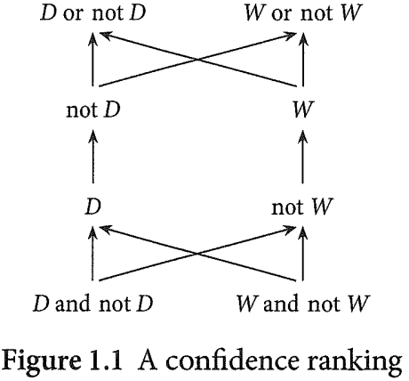

# Fundamentals of Bayesian Epistemology
-----
## Part Ⅰ: Our Subject

### concepts
- propositional attitude: an attitude an agent adopts toward a proposition.
  - hope, desire, fear, wonder whether, intend to make it the case...
  - change the world vs. **represent** what the world is already like (Knowledge, Belief).
    - Philosophers often discuss the class of doxastic attitudes (“belief-like” attitudes) into which belief, disbelief, and certainty fall. **Bayesian epistemology** focuses on a type of doxastic attitude known variously as degree of belief, degree of confidence, or credence.
- a proposition is an abstract entity expressible by a declarative sentence and capable ofbeing true or false.
- True and false are truth-values

Rudolf Carnap (1950) distinguishes three concepts:
- Classificatory concepts:  categorize things or cases into two or a few kinds.
  - belief, disbelief, suspension ofjudgment, and certainty.
  - **binary**: the agent either has that attitude toward the proposition or she doesn’t.
- Quantitative concepts: characterize things, events, or certain features by assigning numerical values.
  - is 90% confident that...
- Comparative concepts: a comparison in the form of a more-less statement without the use of numerical values.

different emphasis:
- traditional or mainstream epistemologists: justification of belief, or about necessary and sufficient conditions for knowledge.
  - a belief, for example, might be reluctant, intransigent, or deeply held. (勉强的、不妥协的，或者是坚定的)
- Bayesian epistemologists: place much more emphasis on **quantitative attitudes** such as credences.

### Binary beliefs
Shortcomings ofbinary belief:
- no difference between doxastic attitudes toward two propositions: nuclear fusion is a viable energy source;  car will stop when she presses the brake pedal
- change
- beliefs as evidence responsive representations of the world and without considering those beliefs' consequences for her actions.

Rationality:
- Theoretical rationality
  - **Belief Consistency**: propositions an agent believes to be logically consistent.
  - **Belief Closure**: If an agent believes A and A entails B then the agent believes B.
- **Practical rationality**: concerns connections between attitudes and **actions**.

Counterexamples to Consistency and Closure:
- **Lottery Paradox** by Kyburg (1961)
    > A fair lottery has sold one million tickets. Because ofthe poor odds, an agent who has purchased a ticket believes her ticket will not win. She also believes, of each other ticket purchased in the lottery, that it will not win. Nevertheless, she believes that at least one purchased ticket will win.
    - resolve: it is irrational for the agent in the Lottery to believe her ticket will lose. 
- **Preface Paradox** Makinson (1965)
    > You write a long nonfiction book with many claims in its main text, each of which you believe. In the acknowledgments at the beginning of the book you write, "While I am indebted to those listed here for their invaluable help, I am sure there remain errors in the main text, for which I take sole responsibility."
    -  it’s hard to deny that it’s rational for them to do so. 
 - the crucial point is that while it remains controversial how to square norms for binary belief with the Lottery and Preface, norms for **rational credence have no trouble with those examples at all**.

### comparative confidence
describe an agent as **at least as confident** of one proposition as another, **more confident** in one proposition than another, or **equally confident** in the two. 

``more confident than`` relations:

- 

**Comparative Entailment**: If an agent believes A entails B then rationality requires an agent to be confident of B $\geq$ A.

### Bayesian epistemology

there are many Bayesian epistemologies. Every view I would call a Bayesian epistemology endorses the following two principles:
- Agents have doxastic attitudes that can usefully be represented by assigning real numbers to claims. (descriptive)
- Rational requirements on those doxastic attitudes can be represented by **mathematical constraints** on the real-number assignments closely related to the **probability calculus**. (normative)

### Relating belief and credence
一般用法：
- doxastic attitude: disbelief, certainty, doubt, suspension of belief, comparative confidence, numerical credence
  - belief: = binary belief, full belief
  - credence or degrees of belief: partial beliefs 部分信念; graded belief 分级信念
  
联系二者的理论：
- **Lockean thesis**
  >  it is rational for you to believe a proposition just in case it is rational for you to have sufficiently high degree of confidence in it.

  **Lockean thesis** connects **believing a proposition** with **possessing a degree of confidence** in that proposition surpassing some numerical threshold 阈值. 

  - Q: how high this threshold must be?
  - If we set a credence threshold for belief **lower than 100%**, and adopt Bayesian probabilistic norms for credence, the Lockean thesis generates rational belief sets for the Lottery and Preface that violate Belief Consistency and Closure. 

- **reductively** 
  > I **have a 60% credence** that the Democrats will lose the next election just in case I believe the proposition that their **probability** of losing is 60%.

  - it’s implausible to think whenever a (rational) agent has a degree of confidence she (also?) has a belief with that kind of **probabilistic content**. If "probability" talk is, for instance, always talk about frequency within a reference class, must I have beliefs about frequencies?

 - **contemporary Bayesians**

numerical value of a credence not as part of the **content** toward which the agent adopts the attitude, but instead as an **attribute of the attitude itself**. **信念的数值不是主体采取态度的内容的一部分，而是该态度本身的属性。**

### 本书内容：

- Bayesian formalism
  -  norms Bayesians require of rational degrees of belief
     - five core normative Bayesian rules
       - Kolmogorov's three probability axioms for unconditional credence
       - the Ratio Formula for conditional credence
       - Conditionalization for updating credences over time
     - variety of norms: supplement or to replace the core five
     - applications of Bayesian epistemology: 
       - confirmation theory (Chapter 6) 
       - decision theory (Chapter 7).
     - Chapter 8: Representation Theorem arguments; 
     - Chapter 9: Dutch Books
     - Chapter 10: arguments based on the goal of having accurate credences.
     - Chapter 11: we might extend Bayesian updating to incorporate memory loss and self-locating belief
     - Chapter 12: Problem of Old Evidence and the Problem ofLogical Omniscience
     - Chapter 13: Problem of the Priors, then compares Bayesianism to the rival statistical paradigms of frequentism and likelihoodism
     - Chapter 14: considers alternative frameworks for modeling levels of confidence that employ the probability calculus but put it to different formal use.