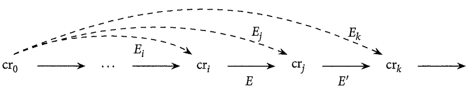
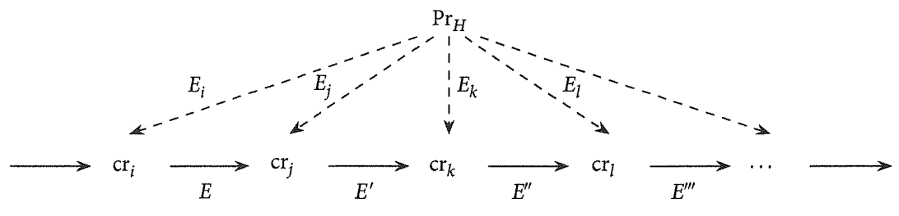

## 2. Probability Distributions

Eventually we're going to suggest that if an agent assigns P and~PΞ) P different credences, she’s making a rational mistake. But we want our formalism to deem it a rational requirement that agents assign the same credence to logical equivalents, not a necessary truth. It's useful to think about **propositions in terms of their associated sets of possible worlds**, so we will continue to do so. But to keep logically equivalent propositions separate entities we **will not say that a proposition just is a set of possible worlds**

......

A **contingent proposition** is neither a contradiction nor a tautology.

**Kolmogorov's axioms**
- Non-Negativity: For any proposition $P$ in $\mathfrak{L}$, $cr(P) \geq 0$.
- Normality: For any tautology $T$ in $\mathfrak{L}$, $cr(T) = 1$.
- Finite Additivity: For any mutually exclusive propositions $P$ and $Q$ in $\mathfrak{L}$, $cr(P \vee Q) = cr(P) + cr(Q)$

### Ratio Formula
For any $P$ and $Q$ in $\mathfrak{L}$, if $cr(Q)>0$ then:
$$cr(P|Q) = \frac{cr(P\wedge Q)}{cr(Q)}$$

### Bayes’s Theorem
For any $H$ and $E$ in $\mathfrak{L}$,
$$cr(H|E) = \frac{cr(E|H)\cdot cr(H)}{cr(E)}$$

### Relevance and independence
Proposition $P$ is probabilistically **independent** of proposition $Q$ relative to distribution $cr$ just in case 
$$cr(P|Q) = cr(P)$$

$Q$ is **irrelevant** to $P$.

## Updating by Conditionalization

### Conditionalization
For any time $t_i$ and later time $t_j$, if proposition $E$ in $\mathfrak{L}$ represents everything the agent learns between $t_i$ and $t_y$, and $cr_{i}(E)>0$, then for any $H$ in $\mathfrak{L}$:
$$cr_{j}(H) = cr_{i}(H|E)$$

作者使用的概念区分：
- **conditional credence**: a genuine mental state, manifested by the agent in various ways at $t_i$ (what she’ll say in conversation, what sorts ofbets she'll accept, etc.) beyond just her dispositions to update.
- **Conditionalization**: a **normative constraint relating** the agent's unconditional credences at a later time to her conditional credences earlier on.

### Evidence and certainty

> When I learn that my sister is coming over for Thanksgiving dinner, I become highly confident in that proposition. But do I become 100% certain? Do I rule out all possible worlds in which she doesn’t show, refusing to consider them ever after? 

This concern about certainties motivates the
**Regularity Principle**: In a rational credence distribution, no logically contingent proposition receives unconditional credence 0.

- The Regularity Principle captures the common-sense idea that one's evidence is never so strong as to entirely rule out any **logical possibility**.
- one should never be absolutely certain of a proposition that’s not **logically true**.
- Conditionalization conflicts with Regularity: the moment an agent conditionalizes on contingent evidence, she assigns credence 1 to a non-tautology.

### Priors and standards

按照条件化的方式更新信念，信念更新像一个滚雪球般的过程。倒推这个过程，我们需要一个初始的信念分配。

The agents credence distribution at this earliest point is sometimes called her **initial prior distribution** (or her“ur-prior”)

- Q: Was there ever a time in a real agent's life when she possessed no contingent information? Since $cr_  0$ satisfies the probability axioms, it must be perfectly attuned to logical relations (such as mutual exclusivity and entailment) and assign a value of1to all tautologies. So the agent who assigns this initial prior must be **omniscient logically** while totally **ignorant empirically**.

An agent's **epistemic standards** govern how she reacts to particular pieces of news. These epistemic standards are determined in part by an agent’s total evidence, and as such evolve over time. 

......

We can represent an agents ultimate epistemic standards
using a regular probability distribution $Pr_H$ over her language $\mathfrak{L}$, which we call her **hypothetical prior distribution**. 

**Hypothetical Priors Theorem**
Given any finite series of credence distributions $\{cr_1, cr_2,\dots, cr_n\}$, each of which satisfies the probability axioms and Ratio Formula, let $E_i$ be a conjunction of the agent's total evidence at $t_i$. **If** each $cr_i$ is related to $cr_{i+1}$ as specified by **Conditionalization**, **then** there exists at least one regular probability distribution $Pr_H$ such that for all $1\leq i\leq n$,
$$cr_i (\cdot) = Pr_H (\cdot |E_i)$$

Proof (?): Hypothetical Priors Theorem

