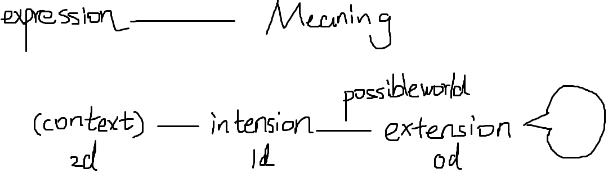
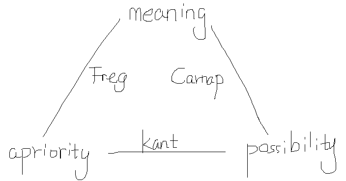

# 2 Dimension Semantic
2D semantic framework David Kaplan's 2D semantic framework for indexicals is widely used to explain conventional semantic rules governing context-dependent expressions like 'I', 'that', or 'here', which pick out different things depending on the context in which the expression is used. And logicians working on tense and modal logic use 2D semantics to characterize the logical implications of operators like 'now', 'actually', and 'necessarily'. Such restricted applications of 2D semantics are intended to systematize and explain uncontroversial aspects of linguistic understanding.

Two-dimensional semantics was introduced to model the semantics of context-sensitive expressions in natural language, like indexicals and demonstratives. A similar 2D framework was developed to model important aspects of tense and modal logic. 

**Semantic** theories explain how the truth or falsity of whole sentences depends on the meanings of their parts by stating rules governing the interpretation of subsentential expressions and their modes of combination.

**The simplest (0-dimensional) semantic** frameworks work by assigning extensions as the semantic values of particular expressions. 

The first enrichment, **standard (1-dimensional) possible worlds semantics**, is introduced to explain the meaning of modal operators like ‘possible’ and ‘necessary’. The semantic value of an expression is an **intension**, a function that assigns an extension to the expression “at” every possible world.

common intuition:
- the most famous japanese singer: function that maps every possible world to the different individual
- うただひかる: constant function that maps every possible world to the very same individual
- one's 'I' refers rigidly to the same one

The second enrichment of the basic extensional semantic framework—the one that is distinctive of two-dimensional semantics—requires us to take possible worlds into account in a different way. **David Kaplan(1989)** first brought widespread attention to this phenomenon of **context-dependence** by proposing his influential two-dimensional semantic theory to clarify the rules governing such expressions.

Kaplan distinguishes two different aspects of the **meaning** of expressions in a public language. 

**two-dimensional intension**:

- **content**, reflects the **modal profile** of the object, kind or property represented. a function mapping possible worlds to extensions.
- **character**, reflects semantic rules governing how the content of an expression may vary from one context of use to the next. a function that takes as input a **context** and yields as output **a function from possible worlds to extensions**. A context-invariant expression like ‘Hillary Clinton’ has a constant character, 
  - **Contexts of use** can be thought of as **“centered” worlds**. $\langle w,a,t\rangle$ possible worlds play two distinct roles in Kaplan's formalism: contexts of use determine which content is expressed and circumstances of evaluation reflect the modal profile of that content.

---

**Accounts of meaning** (Plato, Descartes, Locke, Hume, Frege, Russell, Carnap, and many others), two key theoretical roles:

- Semantic competence: Two speakers (or one speaker on two occasions) share the **same meaning** just in case they associate the very same criterion with their expressions.

- Reference determination: The criterion a speaker currently associates with an expression determines which things fall into its extension in **every possible situation**.

If this traditional account of meaning is correct, then one can make one’s own meanings explicit by engaging in **apriori conceptual analysis**.

In the 1970s and 80s, **semantic externalists** used a variety of persuasive examples to argue that the traditional account of meaning yields an unrealistic picture of (i) semantic competence, (ii) reference determination, and (iii) epistemic access to modal facts. **Proper names and natural kind terms** seem especially problematic for the traditional account.
- no such knowledge seems required for your use of the name to pick out the relevant man in every possible world (Donnellan 1970; Kripke 1980)
- you don’t need to know precisely what it takes for something to count as water in any possible world to be competent with the word ‘water’ or for your word to pick out the chemical substance H2O in every possible world (Kripke 1980; Putnam 1970, 1972).
- making room for the possibility of ignorance and error about reference-conditions seems crucial to explaining **empirical inquiry** into the **nature** of familiar things, and to vindicating the **commonsense realist** idea that **we can refer to things whose nature we don’t fully understand** (Burge 1979, 1986; Putnam 1972, 1973). 

**linguistic competence** or for **determinate reference**. And **apriori conceptual analysis** cannot be trusted to reveal what's genuinely possible—at best, it reveals one's current **fallible** assumptions about the topic in question.

Proponents of G2D believe this pessimistic conclusion is unwarranted. What critics' examples really show, they argue, is that the traditional view of meaning should be **refined, not junked**. competent speakers always have **apriori access** to the reference-fixing criterion for their own use of the name 'Barack Obama', but they have only **aposteriori access** to the associated modal profile. 
-  **David Lewis**, in particular, was a powerful champion of the idea that we can give apriori definitions for terms whose precise reference we do not understand. Lewis articulated the ‘**analytic functionalist**’ approach to specifying the meaning of mental predicates and of theoretical terms in **science** (1966; 1970; 1972; 1979; 1980; 1994); and he was also an early advocate of a generalized 2D approach to semantics (1981; 1994).
- Early proponents of an explicitly two-dimensional semantics for **names and natural kind** terms include Harry Deutsch (1990, 1993), Ulrike Haas-Spohn (1995), and Kai-Yee Wong (1996). However, it is two later theorists—Frank Jackson (1994; 1998a; 1998b; 2004) and **David Chalmers** (1996; 2002b; 2002c; 2004; 2006a)—who have most systematically developed and defended G2D as a way of reconciling the lessons of semantic externalism with the traditional apriori approach to meaning and modality.
- G2D seeks to vindicate the traditional idea that we can know the truth-conditions of our own sentences via **armchair reasoning about hypothetical cases**. The approach promises to explain **why certain necessary truths can only be known aposteriori by appealing to the structure of our implicit semantic understanding**. Proponents of G2D make claims about how the two types of intension may interact with modal and epistemic operators. However, working out the details of the compositional semantics has been a relatively recent concern of proponents of G2D (e.g. Chalmers 2011a, c; Chalmers and Rabern 2014; Johannesson and Packalén 2016; Kipper 2017).

----

**Connecting meaning, apriority, and possibility**

- **empiricist**, an expression's meaning reflects the **causal mechanisms** guiding everyday classification and communication. The empiricist is primarily concerned with causal explanation of linguistic facts. 
- **rationalist**, an expression's meaning reflects what is **apriori accessible** to the speaker on the basis of ideal reflection. rationalist is primarily concerned with idealized apriori rationality and insights into objective possibility.

**David Chalmers** has developed a detailed and influential rationalist interpretation of the 2D framework. This semantic project is situated within a broadly rationalist tradition that posits a "**golden triangle**" of necessary constitutive relations between meaning, apriority, and possibility(2004; 2006a; 2012).

- **Connecting meaning and apriority** : Following **Frege** (1892), Frege took **sameness of cognitive** significance to be the mark of sameness of meaning. According to a **2D rationalist**, sameness of cognitive significance can in most cases be elucidated in terms of apriori equivalence: two expressions are associated with the **same meaning** iff one can know that they pick out the very same things on the basis of **apriori reflection** alone (Chalmers 2002b)
- **Connecting meaning with possibility** : Following Carnap (1947), use possible worlds semantics to individuate particular meanings in terms of their **representational properties**. the meaning of 'doctor' is identified with an intension that maps possible worlds to extensions. An expression's intension reflects the modal profile of the object, kind, or property picked out. If two expressions are associated with the **same meaning** iff two expressions are **co-extensive in all possible worlds**.
-  **Connecting possibility with apriority** : Following Kant (1787) a rationalist about modality holds that what is **necessary** is always knowable **apriori** and what is knowable apriori is always necessary.

the empiricist uses causally efficacious cognitive mechanisms to **isolate** the **reference-fixing criteria** currently associated with an expression, the rationalist uses the **subject's ideally rational judgments** to isolate the complex cognitive states that would ground those reflective judgments. The “golden triangle” also involves a distinctive rationalist account of modal epistemology, according to which ideal apriori conceivability is a fail-safe guide to metaphysical possibility. This **modal rationalism** affords a simple and attractive account of our access to modal facts (Chalmers 1996, 136–8; 1999, 488–91; 2002a).

Roughly, the idea is that 'Hesperus=Phosphorus' is aposteriori because we associate distinct reference-fixing criteria with the two names: e. g., being the brightest star visible in the evening and the brightest star visible the morning. According to the2D rationalist, these reference-fixing criteria are(i) an aspect of meaning, (ii) which can be known apriori via conceptual analysis, and(iii) which suffices to fix the applicability conditions for every possible world considered as one's actual environment. If the2D framework can be used to isolate such an aspect of meaning for all expressions, we will have vindicated the rationalist's "golden triangle" connecting meaning, apriority and possibility.

Chalmers, David (2006)

Scott Soames: Reference and Description: The Case Against Two-Dimensionalism